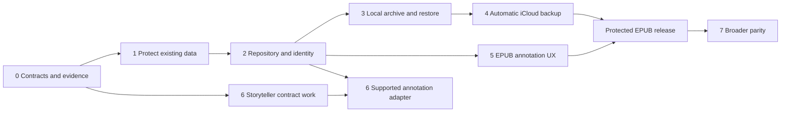

# Phased implementation plan: annotations, Storyteller and iCloud backup

Date: 2026-09-30. Status: Phases 1, 3 and 4 are implemented in code and awaiting device/signed-account acceptance; Phase 2 foundations exist but the reader has not been cut over; Phases 5–7 not started. No exit gate is marked passed until its device evidence exists. See the status summary and progress record below.

This plan implements the direction in [the architecture review](ANNOTATION_SYNC_BACKUP_REVIEW.md) and follows [AGENTS.md](../AGENTS.md), [ARCHITECTURE.md](../ARCHITECTURE.md) and [CONTRIBUTING.md](../CONTRIBUTING.md). It owns sequencing and release gates. The review owns supporting findings and rationale; the earlier [Pencil plan](PENCIL_INK_IMPLEMENTATION_PLAN.md) and [configuration plan](ICLOUD_CONFIGURATION_IMPLEMENTATION_PLAN.md) retain their implementation history. Their narrower MVP exclusions do not limit the long-term scope.

## Delivery strategy

Keep the portable Swift core, Foliate integration and existing app shells. Evolve current actors behind explicit interfaces, preserving existing data and behavior. Build reliable local storage and restore before automatic cloud protection; add richer annotation experiences on that foundation. Use maintained platform/library functionality where it fits, with custom code for EPUB-specific identity, anchoring and reflow.

Initial delivery targets iPad/Pencil authoring and Mac/iPhone annotation viewing, backup and restore. Shared model/storage changes must remain portable; Android/Linux authoring and Apple TV/watch feature expansion have separate acceptance. Core functionality must work without Storyteller or iCloud.

| Phase | Outcome | Hard dependency | Release boundary |
| --- | --- | --- | --- |
| 0 | Agreed contracts, inventories, prototype evidence and fixtures | None | Planning and baseline evidence |
| 1 | Existing annotations cannot silently fail to save or overwrite unreadable originals | Relevant Phase 0 contracts | Reliability release |
| 2 | One durable annotation repository with safe migration and edition identity | Phases 0–1 | Migrated local data foundation |
| 3 | Complete portable annotation/configuration archive and safe local restore | Phase 2 | Local recovery release |
| 4 | Automatic retained iCloud backups with tested restoration | Phase 3 | Cloud protection release |
| 5 | Complete reflowable EPUB annotation experience | Phase 2; Phase 4 for broad authoring rollout | EPUB annotation release |
| 6 | Verified Storyteller interoperability and supported annotation sync | Phase 0 baseline; Phase 2 for annotation replication | Interoperability release |
| 7 | Broader Scribe parity and additional platform capabilities | Relevant earlier foundations | Separate feature releases |

Phase numbers express dependencies, not a requirement to finish every earlier phase before starting any later work. Phase 1 safety fixes can begin while Phase 0 decisions are being documented. UX prototypes and Storyteller contract tests can start early; Phase 5 implementation and Phase 6 existing-feature hardening can proceed after their own dependencies. Phase 4 must not wait for upstream annotation support.

## Phase 0 — Contracts, decisions and baseline

**Purpose:** turn broad parity and backup goals into finite, testable commitments without blocking urgent durability work on a large redesign.

Deliver in small reviewable changes:

- **P0.1 Feature and platform matrix.** List required EPUB tools, margin/inline notes, retrieval, export, accessibility, offline behavior and broader notebook/AI capabilities. Mark each as implemented, awaiting acceptance, planned or unsupported, with evidence. Record the Scribe feature baseline/date and supported EPUB classes; distinguish handwriting authoring from viewing.
- **P0.2 Data inventory.** Enumerate annotations, legacy formats, source IDs/descriptors, book/edition links, progress, themes, palettes, ink-tool preferences, shelves, per-book settings, UserDefaults categories and required assets. For each, record owner, schema, backup inclusion, live-sync policy, restore scope and sensitivity. Secrets and local folder grants need a separate secure recovery policy, not accidental inclusion in a preferences dump.
- **P0.3 Architecture decisions.** Create ADRs under `docs/decisions/` covering storage/transactions/migration; identity/anchor normalization/conflicts; backup format/cloud transport/account boundaries; and native drawing versus custom EPUB behavior. Include failure cases, alternatives and reversal costs. SQLite and private CloudKit are candidates from the review, not selected dependencies yet. Compare the smallest viable alternatives and consult current primary documentation/Context7 before choosing APIs or libraries.
- **P0.4 Bounded prototypes.** Exercise a repository commit plus durable delivery intent, an interrupted snapshot upload/restore, and a native note canvas interacting with Foliate reflow. Use disposable fixtures. Resolve payload portability and drawing conversion fidelity before fixing the Phase 2 schema; resolve cloud completion semantics before Phase 4 implementation.
- **P0.5 Baseline fixtures and measurements.** Collect representative reflowable EPUBs, ebook/readaloud pairs, repeated passages, changed chapter hrefs, large chapters, RTL/vertical content and Unicode. Include legacy/corrupt/future-format annotation files. Capture real Pencil strokes with consent and no private book data in fixtures. Measure current input latency, reflow, indexing, memory and backup payload sizes; set numerical device-specific acceptance budgets before implementation.

**Components:** current models/actors, configuration registry, package/build definitions and existing Swift/WebHarness tests. Reuse the existing configuration work: its latest record reports 206 tests and signed builds, while real-account acceptance remains pending. Reconfirm a baseline against the actual implementation branch; do not treat that prior record as a new test run.

**Exit gate:** every persistent category and target feature has an owner and acceptance rule; ADR choices required by Phase 2 are settled; test devices/server versions are identified; prototypes have written results and any rejected approach is documented. No personal credentials or cloud provisioning material enters the repo.

## Phase 1 — Protect current local data

**Purpose:** address the review's immediate integrity risks through the existing storage boundaries, so the work remains useful during later migration.

- **P1.1 Explicit load outcomes.** Change ink loading to distinguish missing, valid, partially recoverable, corrupt and unsupported-version data. Preserve original bytes and unknown payloads. Decode known optional defaults only where safe; never regenerate durable IDs or coerce unknown annotation types during ordinary reads. Provide a read-only/recovery state for files that cannot be safely edited.
- **P1.2 Observable save results.** Make annotation persistence and flush operations report success/failure. Keep a distinct committed state and pending editing state. Render strokes immediately, but acknowledge “saved” only after a successful durable write. Preserve the prior good file on failure; retain pending edits for retry/export and explain any remaining unsaved work. Do not claim crash survival when storage could not accept a write.
- **P1.3 Lifecycle safety.** Serialize operations per document, capture the correct book/session identity in queued work, and define close, background, WebView replacement and cancellation behavior. Use resumable local persistence; do not rely on a final background callback as the only save opportunity.
- **P1.4 User recovery and regression tests.** Add retry/recovery/export actions for failure states. Replace tests that expect corrupt collections to become empty with tests that prove original data survives. Record each implemented bugfix in `BUGFIX_LOG.md` with reproduction, cause and exact validation.

**Components:** `InkActor`, `InkModels`, `InkSession`, `BookmarkActor`, filesystem persistence, reader view models and focused tests. Introduce interfaces that Phase 2 will reuse; do not build another permanent annotation store.

**Exit gate:** injected write errors, failed reads, malformed collections, future schemas and close/background interruptions cannot be reported as successful saves or overwrite good originals. A successful save survives restart. Reading remains available when annotation recovery is needed. Existing annotation and reader checks pass, with real-device writing smoke checks before release.

**Rollout:** ship independently if useful. Backward-compatible storage changes only in this phase; document any exceptional migration explicitly.

## Phase 2 — Durable annotation repository and identity

**Purpose:** establish one authoritative domain API for all annotation types and a recoverable path from existing files.

- **P2.1 Repository contract.** Add portable commands and queries for bookmarks, highlights, typed notes, ink marks and handwritten notes. Share IDs, source/account ownership, revision metadata, anchors and deletion semantics; retain typed payloads. Keep the renderer as a projection. Adapt existing `InkActor`/`BookmarkActor` APIs during transition instead of rewriting views and unrelated library persistence together.
- **P2.2 Transactions and operation identity.** Implement the selected local store. Commit a mutation, revision and applicable delivery intent together. Use stable operation IDs for retries and tombstones for deletion. Add stable stroke IDs if the chosen conflict granularity requires them. Define retention/garbage collection explicitly; no timestamp-only replacement of whole books.
- **P2.3 Edition and anchor contract.** Preserve source-scoped `BookID`; introduce explicit asset/edition mappings and content fingerprints. Version text normalization, offset units, CFI/context selectors and fallback behavior. Return exact, remapped, ambiguous or unresolved outcomes, retaining the original target and mapping provenance. Make this shared contract available to typed highlights and ink.
- **P2.4 Migration.** Inventory and preserve originals; import into staging; verify identities, counts, editable payload hashes and unresolved records; then switch the authoritative reader/writer through a durable migration marker. Make every step restartable and idempotent. Preserve unrecognized records in recovery storage. Use a journaled cutover for data spanning multiple stores.
- **P2.5 Conflict-safe editing.** Keep concurrent creative revisions when automatic merge is unsafe. Define delete-versus-edit and restore-versus-current behavior. Ensure undo targets the user's operation rather than restoring a whole section over unrelated work. Local editing does not wait for a server.

**Components:** proposed `Kit/Annotations` repository/domain layer, existing actors and models, `Kit/Migrations`, anchor JavaScript and typed bridge, source identity and test fixtures. Names are proposed boundaries, not requirements for an extra package or abstraction per feature.

**Exit gate:** old fixtures migrate exactly once and preserve content; termination at every migration boundary resumes safely; missing books retain annotations; repeated text is not guessed onto the wrong passage; repository/undo tests preserve unrelated edits; existing platforms still build where toolchains are available. Record unavailable-platform limitations explicitly.

**Rollback:** before cutover, reopen original files. After new edits exist, never revert to stale originals; use the compatible archive/recovery path or an explicitly tested reverse migration. Older incompatible builds must refuse unsafe writes. A feature flag alone is not a data rollback strategy.

## Phase 3 — Full local archive and restore

**Purpose:** prove recovery independently of cloud transport. This archive becomes the common format for local export and iCloud snapshots.

- **P3.1 Snapshot coordinator.** Capture a consistent generation across annotations and configuration owners. Freeze or version participants briefly and validate the capture; retry if necessary. Mark unavailable required categories as incomplete. Do not require unrelated settings storage to move into the annotation database solely for backup.
- **P3.2 Archive format.** Implement versioned manifests, record counts, schema versions, source/device/account scope, asset references and content hashes. Include orphans, unresolved conflicts and editable originals. Derive previews/search indexes where practical. Validate imported paths, sizes and references before extraction or application.
- **P3.3 Configuration recovery.** Cover every P0 inventory category, including local/device-class and per-book preferences. Restore through their owning APIs. Preserve portable source/shelf IDs and dormant references; require new folder grants or sign-in when needed. Explicitly document credential recovery and any nonportable settings. Never silently narrow “full configuration” to the existing KVS allowlist.
- **P3.4 Restore service and UI.** Preview contents and missing dependencies, make a pre-restore checkpoint, stage and validate imports, then apply through a recoverable commit. Support fresh installation and merge into existing data; replacement is explicit. Suspend live publishers during restore, isolate obsolete outboxes and reconcile current remote state before any new publication. Preserve conflicting versions for recovery.
- **P3.5 Portable recovery release.** Provide lossless export/import and the minimum UI to inspect/recover orphaned notes without the original book. Explain that EPUB/audio binaries are outside the initial annotation/configuration archive; retain enough identity to reconnect them. Human-readable reading exports can be expanded in Phase 5.

**Exit gate:** restore a representative library to an empty store and to a populated store with independent edits. Verify payload equality, settings, identities and assets. Missing/corrupt assets, unsupported schemas and interrupted restores leave the current library intact or resume from a journaled checkpoint. No old server mutation is replayed merely because an archive was imported.

**Release boundary:** users can recover their complete declared annotation/configuration set from a portable archive. This is local recovery, not yet automatic cloud backup.

## Phase 4 — Automatic iCloud protection

**Purpose:** deliver the automatic-backup goal using the Phase 3 format and restore service, keeping preference sync separate.

- **P4.1 Apple transport.** Implement the single transport selected by the ADR behind a backup interface. Configure shared signing/container identity, separate development/production state and scope records by account and snapshot origin. Multiple devices must create independent generations rather than overwrite one shared backup file.
- **P4.2 Durable scheduling.** Persist backup intent after local commits, coalesce changes, deduplicate unchanged assets, and retry with backoff. Resume after restart. Exercise launch/foreground/background opportunities without depending on guaranteed background runtime. Provide “Back up now” as a useful action, not a requirement for protection.
- **P4.3 Publish completeness.** Upload and verify required assets before committing a complete manifest. Readers ignore partial generations. Enumerate recovery points without relying solely on a mutable latest pointer. Keep diagnostic receipts/identifiers without logging private annotation contents.
- **P4.4 Retention and quota.** Implement the age/count/storage policy settled in the ADR using measured payload sizes. Protect the last known-good point and pre-migration/pre-restore checkpoints according to explicit rules. Garbage-collect only assets unreferenced by retained manifests. If quota prevents a new complete generation, retain existing recovery points and report the failure.
- **P4.5 Account isolation.** Treat sign-out, account change, disabled backup and revoked access as explicit states. Quarantine old-account delivery work, retain local data, and require deliberate reconciliation before publishing retained material to another account. Disabling backup must not silently delete remote history.
- **P4.6 Backup and restore UX.** Show last complete recovery point, pending work, scope, quota/authentication problems and retry actions. Keep “saved locally,” “settings synchronized,” “backup complete” and “restore verified” distinct. Add a cloud backup browser using the existing staged restore flow.

**Components:** proposed AppleKit backup adapter/coordinator, app lifecycle, settings UI, Xcode entitlement/config sources, portable snapshot/outbox contracts and tests. Do not extend KVS with annotation blobs or build a second cloud-only restore implementation.

**Exit gate:** signed Mac, iPad and iPhone acceptance covers initial backup, offline edits/reconnect, process death, partial asset upload, fresh installation, quota errors, account switch, two devices backing up concurrently, retained deletion recovery and restore into an existing library. Assert recovered content, not just counts or successful transport calls. Fake transport tests and signed builds alone do not pass this gate.

**Release boundary:** automatic backup can be advertised for the explicitly tested scope/platforms. Roll out to a small opt-in cohort first, then broaden after restore exercises and performance checks pass. Media-library backup and seamless credential transfer remain separate unless explicitly implemented and validated.

## Phase 5 — Complete the reflowable EPUB annotation experience

**Purpose:** finish the core Scribe-class workflows on durable, recoverable data.

- **P5.1 Retrieve and repair.** Build a common annotation browser with type/color/chapter filters, typed-text and quotation search, thumbnails, navigation, orphan/conflict views and manual reattachment. Include annotations for missing books; do not require the active chapter to be loaded to browse them.
- **P5.2 Inline and margin notes.** Implement expandable/collapsible margins and inline note placement as presentation of anchored domain objects. Handle multiple nearby notes, landscape columns, narrow screens, zoom where applicable, theme changes and layout invalidation. Moving a note distinguishes moving its canvas from changing its target passage.
- **P5.3 Editing tools.** Use the drawing approach selected in Phase 0. Add lasso/select, move, resize, copy, eraser modes, tool/color/width choices and undo/redo with explicit scope. Keep original editable strokes when translating formats. Make classification mistakes correctable rather than relying entirely on stroke heuristics.
- **P5.4 Input, accessibility and performance.** Finish outstanding Pencil device acceptance and dark-theme work. Exercise palm/finger/Pencil interaction, page curl, read-aloud navigation, rotation, split-screen and scrolling. Support VoiceOver, keyboard navigation, scalable controls and understandable save/recovery status. Meet measured latency/memory budgets.
- **P5.5 Edition continuity and sharing.** Move typed highlights onto the shared anchor contract, completing the earlier M6 intent. Validate ebook/readaloud pairs and replaced editions. Add text/Markdown summaries and visual SVG/PDF/image exports with quotations/provenance, clearly distinguished from the editable archive.

**Exit gate:** representative books preserve annotation meaning across supported reflow changes; ambiguity remains recoverable; writing does not trigger unintended navigation; edits and exports survive reopen and Phase 4 restore. A reader can create, find, edit, share, recover and delete each supported annotation type. Every newly introduced payload/configuration category participates in backup before broad release.

**Release boundary:** publish the tested reflowable EPUB parity matrix. Do not describe unfinished fixed-layout, notebook or AI features as included in “full Scribe parity.”

## Phase 6 — Storyteller interoperability

**Purpose:** complete supported server integration without making unsupported capabilities a dependency for local reading or backup.

- **P6.1 Compatibility matrix and contract harness.** Identify representative deployed server versions and roles. Verify current authentication, progress, status, metadata, ratings and collections contracts using supported interfaces and sanitized fixtures. Do not assume that public documentation or the prior review's upstream snapshot establishes the deployed version's capabilities.
- **P6.2 Existing sync hardening.** Audit queue durability, restart/retry, permissions, stale responses, missing books and source/account isolation. Keep private user state distinct from shared catalog changes. Preserve distinct domain conflict rules rather than generalizing every queue into timestamp-only last-writer-wins.
- **P6.3 Annotation adapter, conditional on support.** Only implement a provider after verifying create/read/update/delete, identity, pagination and conflict semantics. Map provider IDs/revisions separately, retain unsupported fields locally, and suppress echo uploads. If the provider lacks idempotency keys, implement a documented reconciliation strategy within what its API can guarantee; do not claim exactly-once remote writes.
- **P6.4 Conflicts and restore.** Test simultaneous edits, delete-versus-edit, out-of-order responses, duplicate events, schema mismatch, account switch and restored older data. Preserve creative revisions where lossless merge is unavailable. Show unsupported, unauthorized and temporarily unavailable as different user states.

**Components:** `StorytellerActor`, `ProgressSyncActor`, `BookEditSyncActor`, source capabilities and proposed annotation-provider adapter through the shared repository. No network calls in annotation views and no annotation payloads hidden in unrelated metadata fields.

**Exit gate:** existing supported operations pass against the declared server matrix; any annotation operation advertised as synchronized survives a verified round trip and failure/concurrency tests. If annotation support is unavailable, ship the verified subset with accurate capability UI and keep the adapter deferred. That external dependency does not block the backup or EPUB releases.

## Phase 7 — Broader parity and platform expansion

Deliver as separately scoped features using the established data and backup contracts:

| Workstream | Required design and acceptance |
| --- | --- |
| Fixed-layout EPUB/PDF | Page/coordinate targets, transforms, zoom, document replacement and format-specific export; do not reuse reflow-text offsets as page coordinates |
| Notebooks | Notebook/page/template/folder models, ordering, search and full backup/restore; retain the same durability and conflict guarantees |
| Handwriting recognition/search | Correctable derived text linked to immutable/editable originals; measured language/accuracy coverage and reindexing behavior |
| Optional AI assistance | Explicit privacy/data-flow policy, user control, provenance and original preservation; local annotation remains independent |
| Android/Linux and additional Apple surfaces | Appropriate input/rendering/storage adapters, portable archive round trips and honest cloud/platform capabilities |
| Optional live iCloud annotation sync | Separate ADR and release; reuse domain revisions/provider mapping, account isolation and conflict-safe undo; retain historical backup independently |

**Exit gate:** each workstream has its own updated parity matrix, migration/backup tests, device acceptance and performance criteria. No blanket “all platforms” or “full parity” claim from completion of one workstream.

## Execution and verification rules

Use one coherent vertical change per review: contract/model, implementation, migration if needed, user-visible failure handling and regression coverage. Avoid unrelated cleanup. Each implementation ticket records dependencies, platforms, data touched, exit evidence and rollback. Update `BUGFIX_LOG.md` for actual fixes and user-facing release notes when appropriate.

Run focused tests during implementation, then the relevant existing checks before a release candidate:

- `scripts/test` for the Swift suites; record test selection when only a focused run is appropriate.
- `npm test` from `SilveranKit/Tests/WebHarness` for reader JavaScript; use its documented dependency setup when needed.
- `scripts/macbuild` and `scripts/iosbuild` for affected Apple app surfaces, using a supported destination. Unsigned builds are compile checks only.
- `scripts/genxproj` after project-definition/configuration changes that require regeneration; apply the repository's formatting expectations to edited code.
- Relevant Linux/Android/TV/watch builds when their code or shared dependencies change, recording unavailable toolchains and the remaining acceptance obligation.
- Device/failure-injection/restore checks specified above, with actual app version, schema, OS, account topology, server version and results recorded. Never put credentials or private annotation content in evidence.

A phase is complete only when its exit evidence exists. Record a blocked external dependency precisely and continue independent work; do not silently lower the gate. Storage/restore correctness, migration failures, unintended data publication and unacknowledged save failures block release. Rollout controls may disable cloud transport or new UI while preserving all local data; they must not silently reverse schemas.

## First implementation batch and scheduling

Start with P0.1/P0.2 inventory and baseline capture, followed immediately by P1.1 protected loading and its regression fixtures, then P1.2/P1.3 save/lifecycle behavior. Complete the storage/identity ADRs and prototypes before the Phase 2 schema migration. This produces useful reliability improvements while the larger choices are resolved.

Estimate each phase after its entry evidence exists. Phase 0 should yield estimates for Phases 1–4 based on actual fixture migration and snapshot results; the native drawing prototype informs Phase 5; server contracts determine Phase 6 scope. Track implementation effort separately from device acceptance, provisioning and external-server availability. The combined program is a multi-month roadmap; no calendar completion date is committed without staffing and prototype results.

## Planning validation

This change creates the plan and links it from the project guidance/review. No implementation phase, runtime bugfix, build, device test, cloud operation or server change was performed by this task. Existing working-tree implementation and validation records are preserved. `git diff --check` passed. A Python documentation check verified local link targets in all four changed/new documents and confirmed eight ordered phases with eight exit gates.

## Status summary (2026-09-30)

| Phase | Code | Remaining before the exit gate |
| --- | --- | --- |
| 0 Contracts | ADRs 001–009; inventories; SQLite and drawing decisions | Refreshed Scribe feature baseline; real EPUB/Pencil fixture corpus; numerical device budgets |
| 1 Protect data | Done (BF-017–BF-019, BF-022–BF-028) | iPad/iPhone/Mac checks 1–13 in [DEVICE_ACCEPTANCE_CHECKLIST.md](DEVICE_ACCEPTANCE_CHECKLIST.md) |
| 2 Repository | Repository, anchors/editions, snapshots, legacy staging; not used by the reader | Owner freeze + journaled cutover of ink/highlights; edition persistence; conflict-aware undo; typed-highlight anchors |
| 3 Local archive | Done: `.silveranbackup` export/import, preview, journaled resumable restore, safety copies, source reconnection | Checks 14–21; reading-progress participant (see below) |
| 4 iCloud backup | Done behind a build switch: CloudKit transport, scheduling, retention, account isolation, UI | Provision container; checks 22–30 on signed builds; small opt-in rollout |
| 5 EPUB UX | Not started (BF-020 anchor fix only) | All of P5 |
| 6 Storyteller | Not started | Server version matrix and contract tests |
| 7 Broader parity | Not started | Separate scoping |

Known gaps in the implemented phases: reading positions for local-folder books are not in the archive yet (server positions return from the server); the "last opened book" route is not restored; background backup uses the existing background-task window only (no BGTaskScheduler job).

## Implementation progress

### 2026-09-30 — First local ink safety increment

- P0.1/P0.2 started with the [initial feature/category inventory](ANNOTATION_SYNC_BACKUP_BASELINE.md); exhaustive field/key policies and external/device baseline remain open.
- Relevant Phase 0 contract accepted in [ADR 001](decisions/001-protected-legacy-ink-persistence.md). Phase 2 storage/identity and Phase 4 cloud choices remain undecided.
- P1.1 ink loading implemented: explicit outcomes, strict required payloads/IDs, supported-version dispatch, raw-byte preservation, read-only record recovery and mutation refusal for unknown/damaged/unreadable data.
- P1.2 ink saving implemented: explicit commit results, committed versus pending session state, retry of latest pending sections and flush success/failure. Captured saves retain source/book identity; disk read/mutate/write has no actor suspension.
- P1.3 started: flush includes accepted strokes; superseded opens are guarded; same-book reattachment retains pending state; switching cannot discard unsaved edits; background flush precedes progress networking. Close/termination/session-retention and full replacement/cancellation acceptance are outstanding.
- P1.4 started: Apple recovery banner with retry and exact-original/pending-ink export, and failure-injection/byte-preservation regression coverage. Single-book ink export is not the Phase 3 archive/import service.
- [BF-017](../BUGFIX_LOG.md#bf-017--protect-ink-originals-and-report-failed-local-saves) records symptom, cause, implementation and validation. Bookmark/highlight persistence was hardened in the next increment below; full Phase 1 release acceptance remains open.

Validation: the final combined source passes 225 Swift tests, 102 WebHarness tests and unsigned Mac/arm64 iOS simulator builds. Exact commands and limitations are in BF-017/BF-018. No phase is marked complete, no cloud or server operations were performed, and no real-device acceptance is claimed.

### 2026-09-30 — Bookmark/highlight commit safety

- [ADR 002](decisions/002-protected-highlight-commits.md) keeps the existing filesystem authority and adds protected, non-suspending highlight mutation commands.
- Explicit load/save/delete results, strict persisted locator types/known-key checks, source/ID validation, committed-only observers, ordered pending-command retry, and diagnostic original/command export are implemented.
- Apple reader/editor recovery keeps failed drafts available and updates the renderer/dismisses editors only after commit. Pending-command state is retained in the shared actor across reader instances; process-loss durability for failed writes is not claimed.
- [BF-018](../BUGFIX_LOG.md#bf-018--commit-bookmarks-and-highlights-before-acknowledging-them) records this increment. P1.3 termination/session-retention acceptance, full P0 decisions/prototypes and all phase exit gates remain open.

Validation: `scripts/test` passes 225 tests in 13 suites; WebHarness passes 102 tests; unsigned Mac and arm64 iOS simulator builds pass. The generic simulator build hit the previously recorded x86_64 StoryAlign compiler failure. `git diff --check` and local documentation links pass. See BF-017/BF-018 for exact commands and unverified device/platform gates.

### 2026-09-30 — Per-book lifecycle and transactional repository foundation

- P1.3: ReadingSessionStore now retains one ink session per source/book, including failed pending edits after reading-session removal. Close/background drain accepted work; stale bridges, renderer generations and old view disappearance cannot detach/update a replacement session. [BF-019](../BUGFIX_LOG.md#bf-019--retain-unsaved-ink-across-reader-closure-and-renderer-replacement) records the actual fix and limits.
- P0.3 storage decision: [ADR 003](decisions/003-transactional-annotation-repository.md) selects namespaced, checksum-pinned SQLite 3.53.4 with a narrow portable binding. `scripts/verify-sqlite-vendor` checks unmodified vendor bytes and all 367 public aliases. The compiled C object exports no unprefixed `sqlite3` definitions.
- P0.4 transaction-plus-intent prototype/P2.1–P2.2 started: the inactive repository API commits typed creative payloads, stable operation IDs, causal revisions/current heads, tombstones, provider delivery intent and separate backup intent atomically. Retries are idempotent; concurrent creative edits/deletion retain both heads. Quarantined delivery does not delete creative history. Corrupt/future/unidentified database schemas are refused and originals preserved.
- Prototype results: failure immediately before COMMIT rolls back the entire mutation and intents; an actual SQLite page-capacity failure rolls back an earlier head deletion; reopening preserves the previous complete state. Independent connections retain concurrent revisions. Tests cover bookmark/highlight payloads, parent/account ownership, unknown versions, explicit conflict resolution and stable retries.
- This does **not** cut over InkActor/BookmarkActor, import any user files, publish provider operations, complete a backup, or settle archive/cloud/drawing contracts. Migration verification, process-kill/power-loss tests, large-library budgets, conflict-aware undo and retention collection remain open.

### 2026-09-30 — Anchor/edition contracts and configuration inventory

- P0.2: [field inventory](ANNOTATION_CONFIGURATION_FIELD_INVENTORY.md) enumerates 72 global/nested TV configuration fields and 23 editable theme fields, with backup inclusion independent of live-sync/apply scope. Dynamic defaults/source/progress/asset/secure-descriptor capture remains unfinished; full-configuration backup is not claimed.
- P0.3 identity/conflict decision: [ADR 004](decisions/004-edition-anchors-and-creative-conflicts.md) adopts normalization version 1, UTF-16 offsets, explicit source/account-scoped editions and finite, fingerprint-verified mappings with provenance. The maintained Swift Crypto product, already resolved at 3.15.1, supplies SHA-256; no custom hash implementation is added.
- P2.3 started: portable exact/remapped/ambiguous/unresolved anchor and attachment contracts retain original targets. Edition models require explicit identity and verified normalized section content; missing/changed assets and cross-account mapping cannot silently reattach.
- The existing renderer no longer guesses repeated passages by nearest offset, and selector windows preserve complete Unicode scalars. Sixteen shared Swift/JavaScript fixtures verify matching outcomes; bounded recovery candidates do not select a winner. [BF-020](../BUGFIX_LOG.md#bf-020--preserve-ambiguous-and-unicode-annotation-targets) records before/after reproduction.
- Edition metadata persistence, automatic verified map discovery, typed-highlight adoption, staging migration/cutover, orphan repair UI, full local archive/restore and subsequent plan work remain open. No phase exit gate is lowered or marked complete.

Combined validation: `scripts/test` passes **243 tests in 17 suites**; `npm test` from WebHarness passes **120 tests**. Final unsigned Mac, arm64 iOS and watchOS simulator builds pass using BF-019's exact commands. Vendor verification, exported-symbol check, `git diff --check` and local document-link checks pass. The Android SDK/NDK/Swift toolchain is absent, Docker's Linux daemon is unavailable, and no tvOS simulator runtime is installed. Real Pencil/VoiceOver/reflow/performance and signed multi-device/cloud/server acceptance remain unverified. No personal credentials, library files, private handwriting, cloud container or server account was inspected or modified.

Additional lifecycle check: successful closure uses a weak identity registry so a replacement view already holding the same ink session cannot split ownership before attaching its bridge. Pending edits retain a strong recovery owner. View close validates both optional bridge and renderer ownership, and an accepted-stroke test suspends the renderer proposal while close starts, then proves the completed stroke survives reopening. This is included in BF-019 and the 243-test run.

### 2026-09-30 — Logical annotation recovery and process-loss evidence

- P0.3/P2 recovery contract: [ADR 005](decisions/005-annotation-snapshots-and-transactional-restore.md) defines schema-1 logical snapshots and transactional merge/replacement. The repository remains inactive in the reader; no legacy files are imported by creating it.
- P3.1/P3.2 annotation participant started: a consistent generation includes exact command bytes and fingerprints, all causal history/current heads, missing-book annotations, creative conflicts, deletion tombstones and nonpublishable delivery diagnostics. Unknown fields/schemas, missing parents, cycles, duplicate identities and incorrect head sets are refused. The current in-memory component has a 512 MiB refusal boundary; device memory and large-library acceptance remain open.
- P3.4 repository restore started: validate before mutation, retain the previous annotation generation in the same transaction, merge histories without resurrecting ancestors, or replace explicitly. Stable request identities and receipts survive restart. Archived/current delivery work is quarantined rather than replayed; backup intent remains separate. App-level publisher suspension and multi-owner restore journaling remain required.
- Schema 2 adds retained restore checkpoints through an atomic schema-1 upgrade. Injected failure before COMMIT preserves both marker and tables. Checkpoint snapshots exclude earlier checkpoints; the full archive must capture retained recovery material separately.
- P0.4/P2 failure evidence: a disposable native child compiled against the exact vendored engine spills changed pages and exits without rollback/close. Reopening recovers uncommitted creative/intents, rolls back an uncommitted schema change, and retains a committed schema change. This is selected-boundary process-loss evidence, not physical power-loss or future whole-migration acceptance.
- [BF-021](../BUGFIX_LOG.md#bf-021--inspect-unknown-sqlite-identity-before-changing-journal-mode) protects an unidentified WAL database before persistent journal configuration. A controlled run with the old guard ordering fails the byte-preservation regression; the fixed source passes it.
- Legacy staging and cutover, edition metadata persistence, configuration/assets/recovery-original archive participants, restore UI, native drawing decisions/prototypes and all later phases remain open. No complete backup or phase exit gate is claimed.

Validation: `scripts/test` passes **254 tests in 19 suites**, including eleven snapshot/process-loss tests. Final unsigned Mac, arm64 iOS and watchOS simulator builds pass using BF-021's exact commands. Scoped Swift formatting lint, `scripts/verify-sqlite-vendor`, `git diff --check` and local document-link checks pass. WebHarness remains at the prior 120-test run; no renderer code changed in this increment. Linux/Android/tvOS availability and real-device/signed-cloud/server acceptance limits remain as recorded above and in BF-021.

### 2026-09-30 — Durable legacy capture and verified staging

- P2.4 started behind the inactive repository API: [ADR 006](decisions/006-legacy-annotation-capture-and-staging.md) commits an exact-byte schema-1 legacy capture before import. A second transaction imports, verifies typed payload/identity/count equality and commits verification plus separate backup intent. Restart retries by capture identity; no provider delivery is queued and no original source is modified.
- Known schema-1/2 ink retains editable strokes, quote selectors and legacy CFIs; V2 bookmarks/highlights/typed notes retain locators, IDs and complete payloads. Files without explicit verified ownership, unsupported formats/fields, corruption or unavailable bytes remain classified recovery material and block a fully decoded capture result. This is not partial-record salvage or a complete owner inventory.
- Stable SHA-256-derived UUIDv8 migration operations are scoped by exact typed document and source/account/book. Reordered inventories or raw JSON formatting do not duplicate imports. Changed creative payloads remain separate roots. Duplicate scoped annotation identities, reused captures with different bytes and independent work in a staging repository are refused.
- Schema 3 adds retained legacy capture and verification. Fresh creation and owned schema-1/2 upgrades are atomic; prior incompatible repository builds refuse the new marker. Full annotation snapshots remain logical schema 1, and the full archive must include legacy recovery captures separately.
- Failure tests preserve the committed raw capture while rolling back creative records, heads, backup intent and verification. Native process-loss fixtures spill pages and exit before/after raw-capture commit and during unfinished staging. Reopening retains committed originals, discards uncommitted staging, and the actual Swift migration API resumes idempotently. Schema-1 and schema-2 upgrades are also interrupted before/after commit.
- Reader authority remains on legacy actors. Owner enumeration/freeze/revalidation, native drawing portability, edition persistence, journaled cutover and conflict-aware editing remain required. Staging verification proves the supplied capture's contents; it is not an authority marker or proof of a complete library. Full archive/restore UI, automatic cloud protection and later work remain open.

Validation: `scripts/test --filter 'LegacyAnnotationMigrationTests|AnnotationCrashRecoveryTests|AnnotationSnapshotTests'` passes **22 tests in three suites**; final `scripts/test` passes **265 tests in 20 suites**. Final unsigned Mac, arm64 iOS and watchOS simulator builds pass using BF-021's exact commands. Scoped formatting lint for six changed/new Swift files, vendor verification, `git diff --check` and local link targets in nine documents pass. No renderer code changed; WebHarness remains at the preceding 120-test run. No real-device, signed-cloud or server acceptance is claimed; unavailable-platform gates remain open.

### 2026-09-30 — Protected configuration owner and recoverable settings edits

- P3.1/P3.3 prerequisite implemented through the existing owner in [ADR 007](decisions/007-protected-configuration-recovery.md). Global configuration reads distinguish missing, valid, corrupt, unsupported and unreadable. Initialization never writes defaults over a failed read. Original bytes remain recoverable; unknown/damaged files and external changes block writeback.
- The protected codec covers known global/nested TV/theme fields, explicit nullable values, supported legacy defaults/aliases, booleans versus numbers, required theme fields, duplicate IDs, duplicate/escaped JSON keys and unsupported closed values. CSS acronym aliases are retained correctly. Foundation handles Unicode/JSON decoding; a narrow lexical check refuses duplicate object keys, including BOM/UTF-16/32 inputs.
- Failed accepted local edits remain separate pending field patches in the actor, survive editor closure, and can be retried/exported. New choices supersede or cancel failed choices. Committed values/change observers advance only after atomic write. Remote-origin commits preserve pending local fields; local retry retains unrelated incoming settings. One nonsuspending owner snapshot returns committed, original/load, pending and save-failure state together.
- Apple reader/settings recovery banners provide retry and export of exact originals plus separate pending/editor patches. The reader view model no longer silently swallows write errors. Preference publication pauses when the local owner needs recovery or has unsaved changes; the existing KVS account/version/quota guards remain. This packet/status work does not implement complete backup or app-level restore.
- [BF-022](../BUGFIX_LOG.md#bf-022--protect-configuration-originals-and-retain-failed-local-edits) records actual before/after reproduction and final checks. Dynamic UserDefaults/source/shelf/progress/font participants, owner generation coordination, native drawing portability, reader cutover, full local archive/restore and subsequent phases remain open. No phase exit gate is passed.

Validation: the pre-fix pair of preservation regressions fails with **nine issues**; final focused configuration checks pass **37 tests in three suites**. `scripts/test` passes **279 tests in 21 suites**. Final unsigned Mac, arm64 iOS and watchOS simulator builds pass using BF-022's exact commands. `git diff --check` and scoped format lint exit 0; two existing naming/reader-loop style warnings remain. No renderer code changed; WebHarness remains at the preceding 120-test run. Real-device recovery/export/accessibility, signed cloud/server and unavailable-platform gates remain open.

### 2026-09-30 — Recoverable theme migration and broader configuration inventory

- P1/P3 prerequisite: [BF-023](../BUGFIX_LOG.md#bf-023--a-failed-flat-color-migration-can-advance-its-completion-sentinel) repairs the startup flat-color conversion. The old sentinel is advisory; validated pre-theme originals still convert, while an explicit themes section is respected. A settings failure or protected owner state leaves conversion eligible for retry. The filesystem retains exact pre-conversion bytes in a content-addressed local recovery copy before the settings commit. A failed marker write after commit retries without creating duplicate themes.
- P0.2: the [field inventory](ANNOTATION_CONFIGURATION_FIELD_INVENTORY.md) now maps reviewed and dynamic UserDefaults key constructors, the Pencil tool preference, sidebar/table state, last-open reference, local content-server configuration, KVS bookkeeping and required custom-font assets. It explicitly excludes credential and provider replay state from a generic archive. These policies do not constitute full capture or restore; source/shelf manifests, progress/history, font licensing and secure descriptor implementation remain open.
- The theme migration recovery copies are a required full-archive participant. No reader authority cutover, complete archive, CloudKit transport or release gate is claimed.

Validation: two pre-fix regressions fail with **five issues**; the focused post-fix run passes **46 tests in four suites**, and `scripts/test` passes **288 tests in 22 suites**. Unsigned Mac, arm64 iOS and watchOS simulator builds pass with BF-023's exact commands. Scoped format lint and `git diff --check` exit 0, with an existing settings naming warning. Real-device startup, physical power-loss, signed cloud/account/server and unavailable-platform acceptance remain open.

### 2026-09-30 — Protected Pencil tool preference owner

- P1/P3 configuration prerequisite: [BF-024](../BUGFIX_LOG.md#bf-024--protect-saved-pencil-tool-choices-from-tolerant-decoding-and-replacement) replaces the view's silent `SilveranInkTools.v1` fallback/write path with a portable protected codec and one main-actor preference owner. Corrupt, unknown, duplicate-key and wrong-type originals cannot be replaced by a default projection. Accepted local choices that fail to save remain pending across reader/WebView replacement for retry or recovery export. The iPad reader presents that status. Valid existing data and the preference key remain compatible.
- This is local UserDefaults acceptance and recovery, not a complete tool-preference archive or guaranteed process-loss survival after a failed write. The separate full archive participant and iPad interaction acceptance are still required.

Validation: focused persistence/model/configuration checks pass **21 tests in three suites**. The first full run encountered timeouts in existing two-second Pencil writing-lock waits while three Apple builds were compiling concurrently; the quiet `scripts/test` rerun passes **292 tests in 23 suites**. Final unsigned Mac, arm64 iOS and watchOS simulator builds pass with BF-024's exact commands. Scoped format lint, `git diff --check` and local document links pass; an existing reader-loop style warning remains. Real Pencil/status/export interaction, physical power-loss, signed cloud/server and unavailable-platform gates remain open. No reader JavaScript or cloud transport changed.

### 2026-09-30 — Review fixes, local archive/restore and automatic iCloud backup

Review of the work above found and fixed:

- [BF-025](../BUGFIX_LOG.md#bf-025--a-failed-credential-save-could-erase-the-working-server-login): a failed credential save could erase the working server login (the in-progress increment had a failing test and no owner fix).
- [BF-026](../BUGFIX_LOG.md#bf-026--each-ink-stroke-re-read-decoded-and-re-encoded-the-whole-book): each stroke save cost scaled with the whole book (0.2–2 s on large books); now ~50 ms at any size.
- [BF-027](../BUGFIX_LOG.md#bf-027--annotation-store-could-refuse-valid-records-after-an-encoder-change-and-restore-checkpoints-grew-without-limit): the repository rejected records on any encoder formatting change; restore checkpoints grew without limit.
- [BF-028](../BUGFIX_LOG.md#bf-028--the-mac-content-server-password-was-stored-in-plain-preferences): the Mac content server password was in plain preferences.

Decisions: [ADR 008](decisions/008-portable-ink-model-and-native-drawing.md) (portable ink stays canonical) and [ADR 009](decisions/009-backup-archive-and-icloud-transport.md) (archive, CloudKit transport, tiered retention, notes + settings scope, no credentials — product choices confirmed by the product owner). ADR 009 also moves the archive ahead of the reader cutover: schema 1 captures the current legacy files read-only.

Phase 3 implemented: `Kit/Backup` archive codec (path/size/hash validation before use, atomic writes), `BackupService` (capture, dry-run preview, safety copy, journal, resume/discard, unknown kinds kept aside) and participants for annotations (merge by identity, local wins, conflicts preserved), configuration (device-scoped fields only on the same device class; not published to preference sync), sources (no secrets; reconnect with original IDs), smart shelves, fonts, preferences (registry units plus allowlisted layout keys and Pencil tools) and recovery copies. Settings > Backup & Restore on iOS and macOS.

Phase 4 implemented: `CloudBackupCoordinator` (debounced/launch/foreground/background opportunities, unchanged-content skip, content-addressed uploads, commit after assets and post-commit re-check, backoff, quota/sign-in reporting, account-change pause, tiered retention, orphan cleanup with a 24-hour grace period) and `CloudKitBackupTransport` (zone `Backups`, zone-change enumeration). Off unless `SILVERAN_CLOUD_BACKUP_CONTAINER` and the CloudBackup entitlements are set in `Local.xcconfig`.

Validation: `scripts/test` passes **330 tests in 30 suites** (new: archive format 5, restore 6, participants 6, cloud backup 8, plus regression tests for BF-025–028). WebHarness 120 tests pass. Unsigned `scripts/macbuild`, `scripts/iosbuild` (iPad A16 simulator) and `scripts/watchbuild` pass; `scripts/verify-sqlite-vendor` and `git diff --check` pass. Not run: any device, signed-build, real CloudKit or visual UI check (simulator access was not granted during this session). Device and account checks are listed in [DEVICE_ACCEPTANCE_CHECKLIST.md](DEVICE_ACCEPTANCE_CHECKLIST.md).
