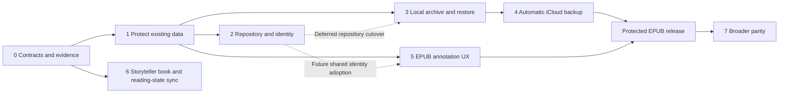

# Phased implementation plan: annotations, iCloud backup and Storyteller book sync

Updated: 2026-10-01. Status: Phases 1, 3, 4 and 4S have code implementations awaiting device/signed-account acceptance; Phase 2 remains inactive and blocked by revision growth; Phase 5 is in progress; Phase 6 has baseline evidence and still needs contract validation; Phase 7 is not started. No exit gate is marked passed until its device evidence exists. Checklist 72 was partly exercised on the isolated QA iPad on 2026-10-01 (BF-048–BF-050 fixed); its iPhone/Mac, keyboard/large-text/VoiceOver and reader-exit parts remain open, followed by the remaining Phase 5 backlog. See the status summary and progress record below.

**Scope decisions (product owner, 2026-09-30):** annotations are never synchronized with Storyteller or any other book server, even if a server later adds annotation support; server synchronization covers books, reading position, reading status, ratings, metadata and collections only. Annotations **must** sync, together with application settings, between the person's own devices through iCloud ([ADR 010](decisions/010-live-icloud-annotation-sync.md)), and are protected by iCloud backup.

This plan implements the direction in [the architecture review](ANNOTATION_SYNC_BACKUP_REVIEW.md) and follows [AGENTS.md](../AGENTS.md), [ARCHITECTURE.md](../ARCHITECTURE.md) and [CONTRIBUTING.md](../CONTRIBUTING.md). It owns sequencing and release gates. The review owns supporting findings and rationale; the earlier [Pencil plan](PENCIL_INK_IMPLEMENTATION_PLAN.md) and [configuration plan](ICLOUD_CONFIGURATION_IMPLEMENTATION_PLAN.md) retain their implementation history. Their narrower MVP exclusions do not limit the long-term scope.

## Delivery strategy

Keep the portable Swift core, Foliate integration and existing app shells. Evolve current actors behind explicit interfaces, preserving existing data and behavior. Build reliable local storage and restore before automatic cloud protection; add richer annotation experiences on that foundation. Use maintained platform/library functionality where it fits, with custom code for EPUB-specific identity, anchoring and reflow.

Initial delivery targets iPad/Pencil authoring and Mac/iPhone annotation viewing, backup and restore. Shared model/storage changes must remain portable; Android/Linux authoring and Apple TV/watch feature expansion have separate acceptance. Core functionality must work without Storyteller or iCloud.

| Phase | Outcome | Hard dependency | Release boundary |
| --- | --- | --- | --- |
| 0 | Agreed contracts, inventories, prototype evidence and fixtures | None | Planning and baseline evidence |
| 1 | Existing annotations cannot silently fail to save or overwrite unreadable originals | Relevant Phase 0 contracts | Reliability release |
| 2 | One durable annotation repository with safe migration and edition identity | Phases 0–1 | Migrated local data foundation |
| 3 | Complete portable annotation/configuration archive and safe local restore | Protected owners and archive contracts (ADR 009); inactive Phase 2 snapshot foundation | Local recovery release |
| 4 | Automatic retained iCloud backups with tested restoration | Phase 3 | Cloud protection release |
| 5 | Complete reflowable EPUB annotation experience | Phase 1 protected owners (ADR 010); Phase 2 cutover deferred; Phase 4 for broad authoring rollout | EPUB annotation release |
| 6 | Verified Storyteller sync of books, reading position, status, ratings and metadata (no annotations) | Phase 0 baseline | Interoperability release |
| 4S | Live iCloud sync of annotations and settings between the person's devices (ADR 010) | Phase 1; Phase 4 build switch | Device sync release |
| 7 | Broader Scribe parity and additional platform capabilities | Relevant earlier foundations | Separate feature releases |

Phase numbers express dependencies, not a requirement to finish every earlier phase before starting any later work. Phase 1 safety fixes can begin while Phase 0 decisions are being documented. UX prototypes and Storyteller contract tests can start early; Phase 5 implementation and Phase 6 existing-feature hardening can proceed after their own dependencies. Phase 4 must not wait for upstream annotation support.

## Phase 0 — Contracts, decisions and baseline

**Purpose:** turn broad parity and backup goals into finite, testable commitments without blocking urgent durability work on a large redesign.

Deliver in small reviewable changes:

- **P0.1 Feature and platform matrix.** List required EPUB tools, margin/inline notes, retrieval, export, accessibility, offline behavior and broader notebook/AI capabilities. Mark each as implemented, awaiting acceptance, planned or unsupported, with evidence. Record the Scribe feature baseline/date and supported EPUB classes; distinguish handwriting authoring from viewing.
- **P0.2 Data inventory.** Enumerate annotations, legacy formats, source IDs/descriptors, book/edition links, progress, themes, palettes, ink-tool preferences, shelves, per-book settings, UserDefaults categories and required assets. For each, record owner, schema, backup inclusion, live-sync policy, restore scope and sensitivity. Secrets and local folder grants need a separate secure recovery policy, not accidental inclusion in a preferences dump.
- **P0.3 Architecture decisions.** Create ADRs under `docs/decisions/` covering storage/transactions/migration; identity/anchor normalization/conflicts; backup format/cloud transport/account boundaries; and native drawing versus custom EPUB behavior. Include failure cases, alternatives and reversal costs. SQLite and private CloudKit are candidates from the review, not selected dependencies yet. Compare the smallest viable alternatives and consult current primary documentation/Context7 before choosing APIs or libraries.
- **P0.4 Bounded prototypes.** Exercise a repository commit plus durable delivery intent, an interrupted snapshot upload/restore, and a native note canvas interacting with Foliate reflow. Use disposable fixtures. Resolve payload portability and drawing conversion fidelity before fixing the Phase 2 schema; resolve cloud completion semantics before Phase 4 implementation.
- **P0.5 Baseline fixtures and measurements.** Collect representative reflowable EPUBs, ebook/readaloud pairs, repeated passages, changed chapter hrefs, large chapters, RTL/vertical content and Unicode. Include legacy/corrupt/future-format annotation files. Capture real Pencil strokes with consent and no private book data in fixtures. Measure current input latency, reflow, indexing, memory and backup payload sizes; set numerical device-specific acceptance budgets before implementation.

**Components:** current models/actors, configuration registry, package/build definitions and existing Swift/WebHarness tests. Reuse the existing configuration work: its latest record reports 206 tests and signed builds, while real-account acceptance remains pending. Reconfirm a baseline against the actual implementation branch; do not treat that prior record as a new test run.

**Exit gate:** every persistent category and target feature has an owner and acceptance rule; ADR choices required by Phase 2 are settled; test devices/server versions are identified; prototypes have written results and any rejected approach is documented. No personal credentials or cloud provisioning material enters the repo.

## Phase 1 — Protect current local data

**Purpose:** address the review's immediate integrity risks through the existing storage boundaries, so the work remains useful during later migration.

- **P1.1 Explicit load outcomes.** Change ink loading to distinguish missing, valid, partially recoverable, corrupt and unsupported-version data. Preserve original bytes and unknown payloads. Decode known optional defaults only where safe; never regenerate durable IDs or coerce unknown annotation types during ordinary reads. Provide a read-only/recovery state for files that cannot be safely edited.
- **P1.2 Observable save results.** Make annotation persistence and flush operations report success/failure. Keep a distinct committed state and pending editing state. Render strokes immediately, but acknowledge “saved” only after a successful durable write. Preserve the prior good file on failure; retain pending edits for retry/export and explain any remaining unsaved work. Do not claim crash survival when storage could not accept a write.
- **P1.3 Lifecycle safety.** Serialize operations per document, capture the correct book/session identity in queued work, and define close, background, WebView replacement and cancellation behavior. Use resumable local persistence; do not rely on a final background callback as the only save opportunity.
- **P1.4 User recovery and regression tests.** Add retry/recovery/export actions for failure states. Replace tests that expect corrupt collections to become empty with tests that prove original data survives. Record each implemented bugfix in `BUGFIX_LOG.md` with reproduction, cause and exact validation.

**Components:** `InkActor`, `InkModels`, `InkSession`, `BookmarkActor`, filesystem persistence, reader view models and focused tests. Introduce interfaces that Phase 2 will reuse; do not build another permanent annotation store.

**Exit gate:** injected write errors, failed reads, malformed collections, future schemas and close/background interruptions cannot be reported as successful saves or overwrite good originals. A successful save survives restart. Reading remains available when annotation recovery is needed. Existing annotation and reader checks pass, with real-device writing smoke checks before release.

**Rollout:** ship independently if useful. Backward-compatible storage changes only in this phase; document any exceptional migration explicitly.

## Phase 2 — Durable annotation repository and identity

**Purpose:** establish one authoritative domain API for all annotation types and a recoverable path from existing files.

- **P2.1 Repository contract.** Add portable commands and queries for bookmarks, highlights, typed notes, ink marks and handwritten notes. Share IDs, source/account ownership, revision metadata, anchors and deletion semantics; retain typed payloads. Keep the renderer as a projection. Adapt existing `InkActor`/`BookmarkActor` APIs during transition instead of rewriting views and unrelated library persistence together.
- **P2.2 Transactions and operation identity.** Implement the selected local store. Commit a mutation, revision and applicable delivery intent together. Use stable operation IDs for retries and tombstones for deletion. Add stable stroke IDs if the chosen conflict granularity requires them. Define retention/garbage collection explicitly; no timestamp-only replacement of whole books.
- **P2.3 Edition and anchor contract.** Preserve source-scoped `BookID`; introduce explicit asset/edition mappings and content fingerprints. Version text normalization, offset units, CFI/context selectors and fallback behavior. Return exact, remapped, ambiguous or unresolved outcomes, retaining the original target and mapping provenance. Make this shared contract available to typed highlights and ink.
- **P2.4 Migration.** Inventory and preserve originals; import into staging; verify identities, counts, editable payload hashes and unresolved records; then switch the authoritative reader/writer through a durable migration marker. Make every step restartable and idempotent. Preserve unrecognized records in recovery storage. Use a journaled cutover for data spanning multiple stores.
- **P2.5 Conflict-safe editing.** Keep concurrent creative revisions when automatic merge is unsafe. Define delete-versus-edit and restore-versus-current behavior. Ensure undo targets the user's operation rather than restoring a whole section over unrelated work. Local editing does not wait for a server.

**Components:** proposed `Kit/Annotations` repository/domain layer, existing actors and models, `Kit/Migrations`, anchor JavaScript and typed bridge, source identity and test fixtures. Names are proposed boundaries, not requirements for an extra package or abstraction per feature.

**Exit gate:** old fixtures migrate exactly once and preserve content; termination at every migration boundary resumes safely; missing books retain annotations; repeated text is not guessed onto the wrong passage; repository/undo tests preserve unrelated edits; existing platforms still build where toolchains are available. Record unavailable-platform limitations explicitly.

**Rollback:** before cutover, reopen original files. After new edits exist, never revert to stale originals; use the compatible archive/recovery path or an explicitly tested reverse migration. Older incompatible builds must refuse unsafe writes. A feature flag alone is not a data rollback strategy.

## Phase 3 — Full local archive and restore

**Purpose:** prove recovery independently of cloud transport. This archive becomes the common format for local export and iCloud snapshots.

- **P3.1 Snapshot coordinator.** Capture a consistent generation across annotations and configuration owners. Freeze or version participants briefly and validate the capture; retry if necessary. Mark unavailable required categories as incomplete. Do not require unrelated settings storage to move into the annotation database solely for backup.
- **P3.2 Archive format.** Implement versioned manifests, record counts, schema versions, source/device/account scope, asset references and content hashes. Include orphans, unresolved conflicts and editable originals. Derive previews/search indexes where practical. Validate imported paths, sizes and references before extraction or application.
- **P3.3 Configuration recovery.** Cover every P0 inventory category, including local/device-class and per-book preferences. Restore through their owning APIs. Preserve portable source/shelf IDs and dormant references; require new folder grants or sign-in when needed. Explicitly document credential recovery and any nonportable settings. Never silently narrow “full configuration” to the existing KVS allowlist.
- **P3.4 Restore service and UI.** Preview contents and missing dependencies, make a pre-restore checkpoint, stage and validate imports, then apply through a recoverable commit. Support fresh installation and merge into existing data; replacement is explicit. Suspend live publishers during restore, isolate obsolete outboxes and reconcile current remote state before any new publication. Preserve conflicting versions for recovery.
- **P3.5 Portable recovery release.** Provide lossless export/import and the minimum UI to inspect/recover orphaned notes without the original book. Explain that EPUB/audio binaries are outside the initial annotation/configuration archive; retain enough identity to reconnect them. Human-readable reading exports can be expanded in Phase 5.

**Exit gate:** restore a representative library to an empty store and to a populated store with independent edits. Verify payload equality, settings, identities and assets. Missing/corrupt assets, unsupported schemas and interrupted restores leave the current library intact or resume from a journaled checkpoint. No old server mutation is replayed merely because an archive was imported.

**Release boundary:** users can recover their complete declared annotation/configuration set from a portable archive. This is local recovery, not yet automatic cloud backup.

## Phase 4 — Automatic iCloud protection

**Purpose:** deliver the automatic-backup goal using the Phase 3 format and restore service, keeping preference sync separate.

- **P4.1 Apple transport.** Implement the single transport selected by the ADR behind a backup interface. Configure shared signing/container identity, separate development/production state and scope records by account and snapshot origin. Multiple devices must create independent generations rather than overwrite one shared backup file.
- **P4.2 Durable scheduling.** Persist backup intent after local commits, coalesce changes, deduplicate unchanged assets, and retry with backoff. Resume after restart. Exercise launch/foreground/background opportunities without depending on guaranteed background runtime. Provide “Back up now” as a useful action, not a requirement for protection.
- **P4.3 Publish completeness.** Upload and verify required assets before committing a complete manifest. Readers ignore partial generations. Enumerate recovery points without relying solely on a mutable latest pointer. Keep diagnostic receipts/identifiers without logging private annotation contents.
- **P4.4 Retention and quota.** Implement the age/count/storage policy settled in the ADR using measured payload sizes. Protect the last known-good point and pre-migration/pre-restore checkpoints according to explicit rules. Garbage-collect only assets unreferenced by retained manifests. If quota prevents a new complete generation, retain existing recovery points and report the failure.
- **P4.5 Account isolation.** Treat sign-out, account change, disabled backup and revoked access as explicit states. Quarantine old-account delivery work, retain local data, and require deliberate reconciliation before publishing retained material to another account. Disabling backup must not silently delete remote history.
- **P4.6 Backup and restore UX.** Show last complete recovery point, pending work, scope, quota/authentication problems and retry actions. Keep “saved locally,” “settings synchronized,” “backup complete” and “restore verified” distinct. Add a cloud backup browser using the existing staged restore flow.

**Components:** proposed AppleKit backup adapter/coordinator, app lifecycle, settings UI, Xcode entitlement/config sources, portable snapshot/outbox contracts and tests. Do not extend KVS with annotation blobs or build a second cloud-only restore implementation.

**Exit gate:** signed Mac, iPad and iPhone acceptance covers initial backup, offline edits/reconnect, process death, partial asset upload, fresh installation, quota errors, account switch, two devices backing up concurrently, retained deletion recovery and restore into an existing library. Assert recovered content, not just counts or successful transport calls. Fake transport tests and signed builds alone do not pass this gate.

**Release boundary:** automatic backup can be advertised for the explicitly tested scope/platforms. Roll out to a small opt-in cohort first, then broaden after restore exercises and performance checks pass. Media-library backup and seamless credential transfer remain separate unless explicitly implemented and validated.

## Phase 4S — Live iCloud sync of annotations and settings

**Purpose:** the person's highlights, bookmarks, notes, handwriting and settings appear on their other devices within about a minute (ADR 010). Committed by product decision 2026-09-30.

- **P4S.1 Sync state and reconciliation.** Per-annotation clocks, content hashes, tombstones and stroke sets beside the owners' files; change detection by reconciliation after commits and at launch.
- **P4S.2 Merge rules.** Latest wins with the losing version kept in recovery; handwritten strokes combined; deletions win or lose by clock; incoming changes applied through the owners; open books reload.
- **P4S.3 CloudKit transport.** `CKSyncEngine`, zone `Annotations`, push notifications, persisted engine state, change-tag conflicts merged and re-sent, account-change handling.
- **P4S.4 One switch and status.** "Sync annotations and settings with iCloud" covers this and the existing settings sync; status and recovery of kept versions in the Annotations screen.

**Exit gate:** simulated multi-device tests pass (convergence, deletions, both conflict rules, strokes, offline, crash between writes); signed two- and three-device checks on the device checklist pass, including offline edits, account change and a device returning after days offline.

## Phase 5 — Complete the reflowable EPUB annotation experience

**Purpose:** finish the core Scribe-class workflows on durable, recoverable data. The [execution backlog](PHASE5_EXECUTION_BACKLOG.md) accounts for every remaining requirement and separates implementation from usability and hardware acceptance. Phase 5 currently uses the protected per-book owners under ADR 010; the Phase 2 reader cutover is deferred, not a prerequisite for this work.

- **P5.1 Retrieve and repair.** Build a common annotation browser with type/color/chapter filters, typed-text and quotation search, thumbnails, navigation, orphan/conflict views and manual reattachment. Include annotations for missing books; do not require the active chapter to be loaded to browse them.
- **P5.2 Inline and margin notes.** Implement expandable/collapsible margins and inline note placement as presentation of anchored domain objects. Handle multiple nearby notes, landscape columns, narrow screens, zoom where applicable, theme changes and layout invalidation. Moving a note distinguishes moving its canvas from changing its target passage.
- **P5.3 Editing tools.** Use the drawing approach selected in Phase 0. Add lasso/select, move, resize, copy, eraser modes, tool/color/width choices and undo/redo with explicit scope. Keep original editable strokes when translating formats. Make classification mistakes correctable rather than relying entirely on stroke heuristics.
- **P5.4 Input, accessibility and performance.** Finish outstanding Pencil device acceptance and dark-theme work. Exercise palm/finger/Pencil interaction, page curl, read-aloud navigation, rotation, split-screen and scrolling. Support VoiceOver, keyboard navigation, scalable controls and understandable save/recovery status. Meet measured latency/memory budgets.
- **P5.5 Edition continuity and sharing.** Move typed highlights onto the shared anchor contract, completing the earlier M6 intent. Validate ebook/readaloud pairs and replaced editions. Add text/Markdown summaries and visual SVG/PDF/image exports with quotations/provenance, clearly distinguished from the editable archive.

**Exit gate:** representative books preserve annotation meaning across supported reflow changes; ambiguity remains recoverable; writing does not trigger unintended navigation; edits and exports survive reopen and Phase 4 restore. A reader can create, find, edit, share, recover and delete each supported annotation type. Every newly introduced payload/configuration category participates in backup before broad release.

**Release boundary:** publish the tested reflowable EPUB parity matrix. Do not describe unfinished fixed-layout, notebook or AI features as included in “full Scribe parity.”

## Phase 6 — Storyteller sync of books and reading state

**Purpose:** make the existing server sync of books, reading position, reading status, ratings, metadata and collections verified and robust. Annotations are out of scope for server sync (scope decision above); they never depend on the server.

- **P6.1 Compatibility matrix and contract harness.** Identify representative deployed server versions and roles. Verify current authentication, progress, status, metadata, ratings and collections contracts using supported interfaces and sanitized fixtures. Do not assume that public documentation or the prior review's upstream snapshot establishes the deployed version's capabilities.
- **P6.2 Existing sync hardening.** Audit queue durability, restart/retry, permissions, stale responses, missing books and source/account isolation. Keep private user state distinct from shared catalog changes. Preserve distinct domain conflict rules rather than generalizing every queue into timestamp-only last-writer-wins.
- **P6.3 Reading-state conflicts and restore.** Test simultaneous position updates from several devices, out-of-order responses, duplicate events, account switch and a backup restore on a device whose server state has moved on. Restore never replays old position, status or book-edit uploads (ADR 009). Show unsupported, unauthorized and temporarily unavailable as different user states.

**Components:** `StorytellerActor`, `ProgressSyncActor`, `ProgressUploadManager`, `BookEditSyncActor` and source capabilities. No annotation data is sent to the server or hidden in server metadata fields. Because other book servers will follow (Phase 7), put new or hardened sync behavior behind the `BookSourceActor` contract and capabilities rather than Storyteller-specific branches in shared code, and keep the contract harness reusable for another backend ([Book sources](../ARCHITECTURE.md#book-sources)).

**Exit gate:** existing supported operations pass against the declared server matrix ([STORYTELLER_COMPATIBILITY.md](STORYTELLER_COMPATIBILITY.md)) with failure and concurrency tests; the server dependency never blocks the backup or EPUB releases.

## Phase 7 — Broader parity and platform expansion

Deliver as separately scoped features using the established data and backup contracts:

| Workstream | Required design and acceptance |
| --- | --- |
| Fixed-layout EPUB/PDF | Page/coordinate targets, transforms, zoom, document replacement and format-specific export; do not reuse reflow-text offsets as page coordinates |
| Notebooks | Notebook/page/template/folder models, ordering, search and full backup/restore; retain the same durability and conflict guarantees |
| Handwriting recognition/search | Correctable derived text linked to immutable/editable originals; measured language/accuracy coverage and reindexing behavior |
| Optional AI assistance | Explicit privacy/data-flow policy, user control, provenance and original preservation; local annotation remains independent |
| Android/Linux and additional Apple surfaces | Appropriate input/rendering/storage adapters, portable archive round trips and honest cloud/platform capabilities |
| Additional book servers (e.g. Audiobookshelf, Grimmory; OPDS for browse/download) | First retire the Storyteller coupling listed in [Book sources](../ARCHITECTURE.md#book-sources) and generalize adding a server; then per backend: an ADR, adapter actor, capability set, reading-position translation with documented precision loss, credentials, source-descriptor backup policy and a compatibility matrix against representative server versions. Annotations stay off every server. Decide the product experience for linking the same work across two servers before carrying annotations between them |

**Exit gate:** each workstream has its own updated parity matrix, migration/backup tests, device acceptance and performance criteria. No blanket “all platforms” or “full parity” claim from completion of one workstream.

## Execution and verification rules

Use one coherent vertical change per review: contract/model, implementation, migration if needed, user-visible failure handling and regression coverage. Avoid unrelated cleanup. Each implementation ticket records dependencies, platforms, data touched, exit evidence and rollback. Update `BUGFIX_LOG.md` for actual fixes and user-facing release notes when appropriate.

Run focused tests during implementation, then the relevant existing checks before a release candidate:

- `scripts/test` for the Swift suites; record test selection when only a focused run is appropriate.
- `npm test` from `SilveranKit/Tests/WebHarness` for reader JavaScript; use its documented dependency setup when needed.
- `scripts/macbuild` and `scripts/iosbuild` for affected Apple app surfaces, using a supported destination. Unsigned builds are compile checks only.
- `scripts/genxproj` after project-definition/configuration changes that require regeneration; apply the repository's formatting expectations to edited code.
- Relevant Linux/Android/TV/watch builds when their code or shared dependencies change, recording unavailable toolchains and the remaining acceptance obligation.
- Device/failure-injection/restore checks specified above, with actual app version, schema, OS, account topology, server version and results recorded. Never put credentials or private annotation content in evidence.

A phase is complete only when its exit evidence exists. Record a blocked external dependency precisely and continue independent work; do not silently lower the gate. Storage/restore correctness, migration failures, unintended data publication and unacknowledged save failures block release. Rollout controls may disable cloud transport or new UI while preserving all local data; they must not silently reverse schemas.

## First implementation batch and scheduling

Start with P0.1/P0.2 inventory and baseline capture, followed immediately by P1.1 protected loading and its regression fixtures, then P1.2/P1.3 save/lifecycle behavior. Complete the storage/identity ADRs and prototypes before the Phase 2 schema migration. This produces useful reliability improvements while the larger choices are resolved.

Estimate each phase after its entry evidence exists. Phase 0 should yield estimates for Phases 1–4 based on actual fixture migration and snapshot results; the native drawing prototype informs Phase 5; server contracts determine Phase 6 scope. Track implementation effort separately from device acceptance, provisioning and external-server availability. The combined program is a multi-month roadmap; no calendar completion date is committed without staffing and prototype results.

## Planning validation

This change creates the plan and links it from the project guidance/review. No implementation phase, runtime bugfix, build, device test, cloud operation or server change was performed by this task. Existing working-tree implementation and validation records are preserved. `git diff --check` passed. A Python documentation check verified local link targets in all four changed/new documents and confirmed eight ordered phases with eight exit gates.

## Status summary (2026-09-30)

| Phase | Code | Remaining before the exit gate |
| --- | --- | --- |
| 0 Contracts | ADRs 001–009; inventories; SQLite and drawing decisions | Refreshed Scribe feature baseline; real EPUB/Pencil fixture corpus; numerical device budgets |
| 1 Protect data | Done (BF-017–BF-019, BF-022–BF-028) | iPad/iPhone/Mac checks 1–13 in [DEVICE_ACCEPTANCE_CHECKLIST.md](DEVICE_ACCEPTANCE_CHECKLIST.md) |
| 2 Repository | Repository, anchors/editions, snapshots, legacy staging; not used by the reader | **Blocked by design issue**: per-stroke revisions grow storage quadratically and can't be compacted ([ADR 003](decisions/003-transactional-annotation-repository.md#cutover-blocker-found-2026-09-30-revision-growth-and-compaction)); deferred until a sync provider needs it. Then: compaction/coarser revisions, owner freeze + journaled cutover, edition persistence, conflict-aware undo |
| 3 Local archive | Done: `.silveranbackup` export/import, preview, journaled resumable restore, safety copies, source reconnection | Checks 14–21 |
| 4 iCloud backup | Done behind a build switch: CloudKit transport, scheduling, retention, account isolation, UI | Verify container/schema provisioning; checks 22–30 on signed builds; small opt-in rollout |
| 4S Device sync | Implemented behind the CloudKit build switch: sync engine, `CKSyncEngine` transport, one switch with settings sync, kept versions ([ADR 010](decisions/010-live-icloud-annotation-sync.md)) | Verify container/schema/push provisioning; checks 38–47 on signed devices |
| 5 EPUB UX | Library browser/filtering and loaded/unopened-chapter inspection/confirmed repair; iPad inline/margin lasso with preview, move/resize, cancel, commit, undo/redo, duplicate and delete; margin viewer; Markdown/HTML/PDF export with native preview | Simulator usability for the final browser/PDF/lasso/repair workflows remains open (Mac locked); real Pencil/accessibility/performance acceptance; typed anchors/compact verified edition evidence implemented (ADR 011), explicit same-book typed chapter/passage repair implemented, while legacy ink evidence/cross-chapter mapping remain in the [execution backlog](PHASE5_EXECUTION_BACKLOG.md); standalone SVG/PNG implemented with native interaction acceptance pending |
| 6 Storyteller (books and reading state only) | P6.1 started: [compatibility matrix](STORYTELLER_COMPATIBILITY.md); known progress/status quirks already handled | Contract test harness from sanitized fixtures; multi-device position conflict tests; re-probe on each server upgrade |
| 7 Broader parity | Not started | Separate scoping |

Scope notes for the implemented phases: reading positions, status and ratings for local-folder books are stored in `library_metadata.json` inside the book folder itself, so they travel with the books (outside the notes + settings scope); server positions return from the server. The "last opened book" route is not restored. Background backup runs in the existing background-task window and the iOS background refresh task, which is also scheduled while a backup is pending.

## Implementation progress

### 2026-09-30 — First local ink safety increment

- P0.1/P0.2 started with the [initial feature/category inventory](ANNOTATION_SYNC_BACKUP_BASELINE.md); exhaustive field/key policies and external/device baseline remain open.
- Relevant Phase 0 contract accepted in [ADR 001](decisions/001-protected-legacy-ink-persistence.md). Phase 2 storage/identity and Phase 4 cloud choices remain undecided.
- P1.1 ink loading implemented: explicit outcomes, strict required payloads/IDs, supported-version dispatch, raw-byte preservation, read-only record recovery and mutation refusal for unknown/damaged/unreadable data.
- P1.2 ink saving implemented: explicit commit results, committed versus pending session state, retry of latest pending sections and flush success/failure. Captured saves retain source/book identity; disk read/mutate/write has no actor suspension.
- P1.3 started: flush includes accepted strokes; superseded opens are guarded; same-book reattachment retains pending state; switching cannot discard unsaved edits; background flush precedes progress networking. Close/termination/session-retention and full replacement/cancellation acceptance are outstanding.
- P1.4 started: Apple recovery banner with retry and exact-original/pending-ink export, and failure-injection/byte-preservation regression coverage. Single-book ink export is not the Phase 3 archive/import service.
- [BF-017](../BUGFIX_LOG.md#bf-017--protect-ink-originals-and-report-failed-local-saves) records symptom, cause, implementation and validation. Bookmark/highlight persistence was hardened in the next increment below; full Phase 1 release acceptance remains open.

Validation: the final combined source passes 225 Swift tests, 102 WebHarness tests and unsigned Mac/arm64 iOS simulator builds. Exact commands and limitations are in BF-017/BF-018. No phase is marked complete, no cloud or server operations were performed, and no real-device acceptance is claimed.

### 2026-09-30 — Bookmark/highlight commit safety

- [ADR 002](decisions/002-protected-highlight-commits.md) keeps the existing filesystem authority and adds protected, non-suspending highlight mutation commands.
- Explicit load/save/delete results, strict persisted locator types/known-key checks, source/ID validation, committed-only observers, ordered pending-command retry, and diagnostic original/command export are implemented.
- Apple reader/editor recovery keeps failed drafts available and updates the renderer/dismisses editors only after commit. Pending-command state is retained in the shared actor across reader instances; process-loss durability for failed writes is not claimed.
- [BF-018](../BUGFIX_LOG.md#bf-018--commit-bookmarks-and-highlights-before-acknowledging-them) records this increment. P1.3 termination/session-retention acceptance, full P0 decisions/prototypes and all phase exit gates remain open.

Validation: `scripts/test` passes 225 tests in 13 suites; WebHarness passes 102 tests; unsigned Mac and arm64 iOS simulator builds pass. The generic simulator build hit the previously recorded x86_64 StoryAlign compiler failure. `git diff --check` and local documentation links pass. See BF-017/BF-018 for exact commands and unverified device/platform gates.

### 2026-09-30 — Per-book lifecycle and transactional repository foundation

- P1.3: ReadingSessionStore now retains one ink session per source/book, including failed pending edits after reading-session removal. Close/background drain accepted work; stale bridges, renderer generations and old view disappearance cannot detach/update a replacement session. [BF-019](../BUGFIX_LOG.md#bf-019--retain-unsaved-ink-across-reader-closure-and-renderer-replacement) records the actual fix and limits.
- P0.3 storage decision: [ADR 003](decisions/003-transactional-annotation-repository.md) selects namespaced, checksum-pinned SQLite 3.53.4 with a narrow portable binding. `scripts/verify-sqlite-vendor` checks unmodified vendor bytes and all 367 public aliases. The compiled C object exports no unprefixed `sqlite3` definitions.
- P0.4 transaction-plus-intent prototype/P2.1–P2.2 started: the inactive repository API commits typed creative payloads, stable operation IDs, causal revisions/current heads, tombstones, provider delivery intent and separate backup intent atomically. Retries are idempotent; concurrent creative edits/deletion retain both heads. Quarantined delivery does not delete creative history. Corrupt/future/unidentified database schemas are refused and originals preserved.
- Prototype results: failure immediately before COMMIT rolls back the entire mutation and intents; an actual SQLite page-capacity failure rolls back an earlier head deletion; reopening preserves the previous complete state. Independent connections retain concurrent revisions. Tests cover bookmark/highlight payloads, parent/account ownership, unknown versions, explicit conflict resolution and stable retries.
- This does **not** cut over InkActor/BookmarkActor, import any user files, publish provider operations, complete a backup, or settle archive/cloud/drawing contracts. Migration verification, process-kill/power-loss tests, large-library budgets, conflict-aware undo and retention collection remain open.

### 2026-09-30 — Anchor/edition contracts and configuration inventory

- P0.2: [field inventory](ANNOTATION_CONFIGURATION_FIELD_INVENTORY.md) enumerates 72 global/nested TV configuration fields and 23 editable theme fields, with backup inclusion independent of live-sync/apply scope. Dynamic defaults/source/progress/asset/secure-descriptor capture remains unfinished; full-configuration backup is not claimed.
- P0.3 identity/conflict decision: [ADR 004](decisions/004-edition-anchors-and-creative-conflicts.md) adopts normalization version 1, UTF-16 offsets, explicit source/account-scoped editions and finite, fingerprint-verified mappings with provenance. The maintained Swift Crypto product, already resolved at 3.15.1, supplies SHA-256; no custom hash implementation is added.
- P2.3 started: portable exact/remapped/ambiguous/unresolved anchor and attachment contracts retain original targets. Edition models require explicit identity and verified normalized section content; missing/changed assets and cross-account mapping cannot silently reattach.
- The existing renderer no longer guesses repeated passages by nearest offset, and selector windows preserve complete Unicode scalars. Sixteen shared Swift/JavaScript fixtures verify matching outcomes; bounded recovery candidates do not select a winner. [BF-020](../BUGFIX_LOG.md#bf-020--preserve-ambiguous-and-unicode-annotation-targets) records before/after reproduction.
- Edition metadata persistence, automatic verified map discovery, typed-highlight adoption, staging migration/cutover, orphan repair UI, full local archive/restore and subsequent plan work remain open. No phase exit gate is lowered or marked complete.

Combined validation: `scripts/test` passes **243 tests in 17 suites**; `npm test` from WebHarness passes **120 tests**. Final unsigned Mac, arm64 iOS and watchOS simulator builds pass using BF-019's exact commands. Vendor verification, exported-symbol check, `git diff --check` and local document-link checks pass. The Android SDK/NDK/Swift toolchain is absent, Docker's Linux daemon is unavailable, and no tvOS simulator runtime is installed. Real Pencil/VoiceOver/reflow/performance and signed multi-device/cloud/server acceptance remain unverified. No personal credentials, library files, private handwriting, cloud container or server account was inspected or modified.

Additional lifecycle check: successful closure uses a weak identity registry so a replacement view already holding the same ink session cannot split ownership before attaching its bridge. Pending edits retain a strong recovery owner. View close validates both optional bridge and renderer ownership, and an accepted-stroke test suspends the renderer proposal while close starts, then proves the completed stroke survives reopening. This is included in BF-019 and the 243-test run.

### 2026-09-30 — Logical annotation recovery and process-loss evidence

- P0.3/P2 recovery contract: [ADR 005](decisions/005-annotation-snapshots-and-transactional-restore.md) defines schema-1 logical snapshots and transactional merge/replacement. The repository remains inactive in the reader; no legacy files are imported by creating it.
- P3.1/P3.2 annotation participant started: a consistent generation includes exact command bytes and fingerprints, all causal history/current heads, missing-book annotations, creative conflicts, deletion tombstones and nonpublishable delivery diagnostics. Unknown fields/schemas, missing parents, cycles, duplicate identities and incorrect head sets are refused. The current in-memory component has a 512 MiB refusal boundary; device memory and large-library acceptance remain open.
- P3.4 repository restore started: validate before mutation, retain the previous annotation generation in the same transaction, merge histories without resurrecting ancestors, or replace explicitly. Stable request identities and receipts survive restart. Archived/current delivery work is quarantined rather than replayed; backup intent remains separate. App-level publisher suspension and multi-owner restore journaling remain required.
- Schema 2 adds retained restore checkpoints through an atomic schema-1 upgrade. Injected failure before COMMIT preserves both marker and tables. Checkpoint snapshots exclude earlier checkpoints; the full archive must capture retained recovery material separately.
- P0.4/P2 failure evidence: a disposable native child compiled against the exact vendored engine spills changed pages and exits without rollback/close. Reopening recovers uncommitted creative/intents, rolls back an uncommitted schema change, and retains a committed schema change. This is selected-boundary process-loss evidence, not physical power-loss or future whole-migration acceptance.
- [BF-021](../BUGFIX_LOG.md#bf-021--inspect-unknown-sqlite-identity-before-changing-journal-mode) protects an unidentified WAL database before persistent journal configuration. A controlled run with the old guard ordering fails the byte-preservation regression; the fixed source passes it.
- Legacy staging and cutover, edition metadata persistence, configuration/assets/recovery-original archive participants, restore UI, native drawing decisions/prototypes and all later phases remain open. No complete backup or phase exit gate is claimed.

Validation: `scripts/test` passes **254 tests in 19 suites**, including eleven snapshot/process-loss tests. Final unsigned Mac, arm64 iOS and watchOS simulator builds pass using BF-021's exact commands. Scoped Swift formatting lint, `scripts/verify-sqlite-vendor`, `git diff --check` and local document-link checks pass. WebHarness remains at the prior 120-test run; no renderer code changed in this increment. Linux/Android/tvOS availability and real-device/signed-cloud/server acceptance limits remain as recorded above and in BF-021.

### 2026-09-30 — Durable legacy capture and verified staging

- P2.4 started behind the inactive repository API: [ADR 006](decisions/006-legacy-annotation-capture-and-staging.md) commits an exact-byte schema-1 legacy capture before import. A second transaction imports, verifies typed payload/identity/count equality and commits verification plus separate backup intent. Restart retries by capture identity; no provider delivery is queued and no original source is modified.
- Known schema-1/2 ink retains editable strokes, quote selectors and legacy CFIs; V2 bookmarks/highlights/typed notes retain locators, IDs and complete payloads. Files without explicit verified ownership, unsupported formats/fields, corruption or unavailable bytes remain classified recovery material and block a fully decoded capture result. This is not partial-record salvage or a complete owner inventory.
- Stable SHA-256-derived UUIDv8 migration operations are scoped by exact typed document and source/account/book. Reordered inventories or raw JSON formatting do not duplicate imports. Changed creative payloads remain separate roots. Duplicate scoped annotation identities, reused captures with different bytes and independent work in a staging repository are refused.
- Schema 3 adds retained legacy capture and verification. Fresh creation and owned schema-1/2 upgrades are atomic; prior incompatible repository builds refuse the new marker. Full annotation snapshots remain logical schema 1, and the full archive must include legacy recovery captures separately.
- Failure tests preserve the committed raw capture while rolling back creative records, heads, backup intent and verification. Native process-loss fixtures spill pages and exit before/after raw-capture commit and during unfinished staging. Reopening retains committed originals, discards uncommitted staging, and the actual Swift migration API resumes idempotently. Schema-1 and schema-2 upgrades are also interrupted before/after commit.
- Reader authority remains on legacy actors. Owner enumeration/freeze/revalidation, native drawing portability, edition persistence, journaled cutover and conflict-aware editing remain required. Staging verification proves the supplied capture's contents; it is not an authority marker or proof of a complete library. Full archive/restore UI, automatic cloud protection and later work remain open.

Validation: `scripts/test --filter 'LegacyAnnotationMigrationTests|AnnotationCrashRecoveryTests|AnnotationSnapshotTests'` passes **22 tests in three suites**; final `scripts/test` passes **265 tests in 20 suites**. Final unsigned Mac, arm64 iOS and watchOS simulator builds pass using BF-021's exact commands. Scoped formatting lint for six changed/new Swift files, vendor verification, `git diff --check` and local link targets in nine documents pass. No renderer code changed; WebHarness remains at the preceding 120-test run. No real-device, signed-cloud or server acceptance is claimed; unavailable-platform gates remain open.

### 2026-09-30 — Protected configuration owner and recoverable settings edits

- P3.1/P3.3 prerequisite implemented through the existing owner in [ADR 007](decisions/007-protected-configuration-recovery.md). Global configuration reads distinguish missing, valid, corrupt, unsupported and unreadable. Initialization never writes defaults over a failed read. Original bytes remain recoverable; unknown/damaged files and external changes block writeback.
- The protected codec covers known global/nested TV/theme fields, explicit nullable values, supported legacy defaults/aliases, booleans versus numbers, required theme fields, duplicate IDs, duplicate/escaped JSON keys and unsupported closed values. CSS acronym aliases are retained correctly. Foundation handles Unicode/JSON decoding; a narrow lexical check refuses duplicate object keys, including BOM/UTF-16/32 inputs.
- Failed accepted local edits remain separate pending field patches in the actor, survive editor closure, and can be retried/exported. New choices supersede or cancel failed choices. Committed values/change observers advance only after atomic write. Remote-origin commits preserve pending local fields; local retry retains unrelated incoming settings. One nonsuspending owner snapshot returns committed, original/load, pending and save-failure state together.
- Apple reader/settings recovery banners provide retry and export of exact originals plus separate pending/editor patches. The reader view model no longer silently swallows write errors. Preference publication pauses when the local owner needs recovery or has unsaved changes; the existing KVS account/version/quota guards remain. This packet/status work does not implement complete backup or app-level restore.
- [BF-022](../BUGFIX_LOG.md#bf-022--protect-configuration-originals-and-retain-failed-local-edits) records actual before/after reproduction and final checks. Dynamic UserDefaults/source/shelf/progress/font participants, owner generation coordination, native drawing portability, reader cutover, full local archive/restore and subsequent phases remain open. No phase exit gate is passed.

Validation: the pre-fix pair of preservation regressions fails with **nine issues**; final focused configuration checks pass **37 tests in three suites**. `scripts/test` passes **279 tests in 21 suites**. Final unsigned Mac, arm64 iOS and watchOS simulator builds pass using BF-022's exact commands. `git diff --check` and scoped format lint exit 0; two existing naming/reader-loop style warnings remain. No renderer code changed; WebHarness remains at the preceding 120-test run. Real-device recovery/export/accessibility, signed cloud/server and unavailable-platform gates remain open.

### 2026-09-30 — Recoverable theme migration and broader configuration inventory

- P1/P3 prerequisite: [BF-023](../BUGFIX_LOG.md#bf-023--a-failed-flat-color-migration-can-advance-its-completion-sentinel) repairs the startup flat-color conversion. The old sentinel is advisory; validated pre-theme originals still convert, while an explicit themes section is respected. A settings failure or protected owner state leaves conversion eligible for retry. The filesystem retains exact pre-conversion bytes in a content-addressed local recovery copy before the settings commit. A failed marker write after commit retries without creating duplicate themes.
- P0.2: the [field inventory](ANNOTATION_CONFIGURATION_FIELD_INVENTORY.md) now maps reviewed and dynamic UserDefaults key constructors, the Pencil tool preference, sidebar/table state, last-open reference, local content-server configuration, KVS bookkeeping and required custom-font assets. It explicitly excludes credential and provider replay state from a generic archive. These policies do not constitute full capture or restore; source/shelf manifests, progress/history, font licensing and secure descriptor implementation remain open.
- The theme migration recovery copies are a required full-archive participant. No reader authority cutover, complete archive, CloudKit transport or release gate is claimed.

Validation: two pre-fix regressions fail with **five issues**; the focused post-fix run passes **46 tests in four suites**, and `scripts/test` passes **288 tests in 22 suites**. Unsigned Mac, arm64 iOS and watchOS simulator builds pass with BF-023's exact commands. Scoped format lint and `git diff --check` exit 0, with an existing settings naming warning. Real-device startup, physical power-loss, signed cloud/account/server and unavailable-platform acceptance remain open.

### 2026-09-30 — Protected Pencil tool preference owner

- P1/P3 configuration prerequisite: [BF-024](../BUGFIX_LOG.md#bf-024--protect-saved-pencil-tool-choices-from-tolerant-decoding-and-replacement) replaces the view's silent `SilveranInkTools.v1` fallback/write path with a portable protected codec and one main-actor preference owner. Corrupt, unknown, duplicate-key and wrong-type originals cannot be replaced by a default projection. Accepted local choices that fail to save remain pending across reader/WebView replacement for retry or recovery export. The iPad reader presents that status. Valid existing data and the preference key remain compatible.
- This is local UserDefaults acceptance and recovery, not a complete tool-preference archive or guaranteed process-loss survival after a failed write. The separate full archive participant and iPad interaction acceptance are still required.

Validation: focused persistence/model/configuration checks pass **21 tests in three suites**. The first full run encountered timeouts in existing two-second Pencil writing-lock waits while three Apple builds were compiling concurrently; the quiet `scripts/test` rerun passes **292 tests in 23 suites**. Final unsigned Mac, arm64 iOS and watchOS simulator builds pass with BF-024's exact commands. Scoped format lint, `git diff --check` and local document links pass; an existing reader-loop style warning remains. Real Pencil/status/export interaction, physical power-loss, signed cloud/server and unavailable-platform gates remain open. No reader JavaScript or cloud transport changed.

### 2026-09-30 — Review fixes, local archive/restore and automatic iCloud backup

Review of the work above found and fixed:

- [BF-025](../BUGFIX_LOG.md#bf-025--a-failed-credential-save-could-erase-the-working-server-login): a failed credential save could erase the working server login (the in-progress increment had a failing test and no owner fix).
- [BF-026](../BUGFIX_LOG.md#bf-026--each-ink-stroke-re-read-decoded-and-re-encoded-the-whole-book): each stroke save cost scaled with the whole book (0.2–2 s on large books); now ~50 ms at any size.
- [BF-027](../BUGFIX_LOG.md#bf-027--annotation-store-could-refuse-valid-records-after-an-encoder-change-and-restore-checkpoints-grew-without-limit): the repository rejected records on any encoder formatting change; restore checkpoints grew without limit.
- [BF-028](../BUGFIX_LOG.md#bf-028--the-mac-content-server-password-was-stored-in-plain-preferences): the Mac content server password was in plain preferences.

Decisions: [ADR 008](decisions/008-portable-ink-model-and-native-drawing.md) (portable ink stays canonical) and [ADR 009](decisions/009-backup-archive-and-icloud-transport.md) (archive, CloudKit transport, tiered retention, notes + settings scope, no credentials — product choices confirmed by the product owner). ADR 009 also moves the archive ahead of the reader cutover: schema 1 captures the current legacy files read-only.

Phase 3 implemented: `Kit/Backup` archive codec (path/size/hash validation before use, atomic writes), `BackupService` (capture, dry-run preview, safety copy, journal, resume/discard, unknown kinds kept aside) and participants for annotations (merge by identity, local wins, conflicts preserved), configuration (device-scoped fields only on the same device class; not published to preference sync), sources (no secrets; reconnect with original IDs), smart shelves, fonts, preferences (registry units plus allowlisted layout keys and Pencil tools) and recovery copies. Settings > Backup & Restore on iOS and macOS.

Phase 4 implemented: `CloudBackupCoordinator` (debounced/launch/foreground/background opportunities, unchanged-content skip, content-addressed uploads, commit after assets and post-commit re-check, backoff, quota/sign-in reporting, account-change pause, tiered retention, orphan cleanup with a 24-hour grace period) and `CloudKitBackupTransport` (zone `Backups`, zone-change enumeration). Off unless `SILVERAN_CLOUD_BACKUP_CONTAINER` and the CloudBackup entitlements are set in `Local.xcconfig`.

Validation: `scripts/test` passes **330 tests in 30 suites** (new: archive format 5, restore 6, participants 6, cloud backup 8, plus regression tests for BF-025–028). WebHarness 120 tests pass. Unsigned `scripts/macbuild`, `scripts/iosbuild` (iPad A16 simulator) and `scripts/watchbuild` pass; `scripts/verify-sqlite-vendor` and `git diff --check` pass. Not run: any device, signed-build, real CloudKit or visual UI check (simulator access was not granted during this session). Device and account checks are listed in [DEVICE_ACCEPTANCE_CHECKLIST.md](DEVICE_ACCEPTANCE_CHECKLIST.md).

### 2026-09-30 — Phase 2 blocker recorded; annotation browser and export

- Phase 2: before implementing the reader cutover, analysis found that per-stroke section saves would create one whole-note revision per stroke (quadratic growth) with no valid compaction under ADR 005 snapshot rules, and that `backup_intent` rows are never cleared. Recorded as a blocker with options in [ADR 003](decisions/003-transactional-annotation-repository.md#cutover-blocker-found-2026-09-30-revision-growth-and-compaction). Cutover is deferred until a replicating provider needs it; Phase 5 proceeds on the protected per-book owners, whose read APIs a later cutover keeps.
- P5.1 repair (2026-09-30, product decision: suggest, then confirm): when a chapter's handwriting no longer finds its words (usually a replaced edition), the reader shows "N annotations couldn't find their place in this edition · Review". The review sheet lists each note or mark with a suggested place: the same words (repeated passage: the copy nearest the old position) or the stretch sharing at least 60% of the anchor's words (`suggestAnchorOffset` / `suggestMarkOffsets` in `InkAnchoring.js`). The person chooses Attach here, Show in book, Attach to current page (notes, same chapter only), or Delete. Nothing moves without a tap; each action is one undo step (`InkOperation.reanchorNote` / `.reanchorMark`, `InkSession.acceptRepair` / `attachNoteToCurrentPage` / `deleteInk`). Scope: loaded chapters only, handwriting only (typed highlights keep their existing path). Verified on the iPad simulator with a seeded edited-edition fixture; tests: `inkRepair.test.mjs`, `InkSessionModelTests` (Repair). "Show in book" marks the suggested words for 4 seconds (CSS Custom Highlight API; the style is changed on removal because WebKit does not repaint when a highlight is only unregistered).
- P5.1 typed highlights (2026-09-30): a typed highlight whose CFI no longer lands on its saved words (letters and digits compared, `comparableText`) is no longer drawn on the wrong words; the page reports it (`HighlightOrphaned`) and it joins the same review sheet ("Was: …", suggested passage via `suggestQuoteOffsets`: the quote found once, the copy nearest the old position, or the closest shared-words match). Attach here rewrites the locator (new CFI, `domRange`/`cssSelector` cleared, saved words updated; colour, note and date kept); Show in book marks the words; Delete asks first and cannot be undone. Behaviour change to watch: a highlight whose saved text differs from the book text for another reason now shows in the sheet instead of drawing. Verified on the iPad simulator (a misplaced highlight repaired; a correct one still drawn and not flagged).
- P5.2 margin notes (2026-09-30, product decisions: collapsible margin; icon, tap to open on narrow screens): `InkNote.placement = .margin` (+ `refWidth`) marks handwriting that sits beside a line instead of in the text flow; in-text notes are encoded exactly as before. Drawn by `InkMargin.js` (`MarginLayer`, one SVG over the document like foliate's Overlayer, because positioned HTML inside the multi-column flow lands in flow coordinates). The margin is the paginator gap: 0% for books without margin notes, 6% (icons) once a book has one, 20% when opened from the toolbar button "Margin for notes" or by tapping an icon (the tapped note's line is kept in view). Pencil strokes in the open margin become margin notes or extend the one beside them (`proposeMarginStroke`); the eraser reaches them. Where a column is under 480pt (iPhone) the margin never opens and an icon tap shows the note in a sheet. Compatibility: older builds refuse margin notes in protected reads and sync payloads (recovery, never silent conversion), so every device must update before margin notes are written. Verified on the iPad simulator (icon, open margin, note drawn beside its line); Pencil writing in the margin and the iPhone sheet still need device checks.
- Build fix (2026-09-30): an unsigned build (`SILVERAN_DISABLE_CODE_SIGNING=1`) no longer names the iCloud container (`SILVERAN_APP_CLOUD_BACKUP_CONTAINER` is empty unless `CODE_SIGNING_ALLOWED=YES`); before, simulator builds crashed at launch in `CKContainer(identifier:)` once `Local.xcconfig` enabled CloudKit.
- P5.1/P5.5: `AnnotationLibrary` indexes every book's highlights, bookmarks, handwritten notes and marks through the owners (including books no longer in the library and a recovery flag for damaged files), with accent/case-insensitive search, type/color filters and a Markdown summary export. `ReaderOpenRequest` lets the reader open at an annotation (CFI for highlights, chapter for handwriting). UI: More > Annotations on iPhone/iPad; Utilities > Annotations (⇧⌘A) on Mac.

Validation: `scripts/test` passes **335 tests in 31 suites** (new `AnnotationLibraryTests`: 3; `restoreIntoOpenBook` and `refusedWhenEditorsCannotSave` from the preceding restore fix). Unsigned Mac and iPad-simulator builds pass. Not run: visual/device checks of the browser and "Show in Book".

Follow-up: web-page export draws handwriting as inline SVG with its original colors and widths (text escaped; stroke colors restricted to hex), groups every annotation under its chapter title (handwriting borrows the title from other annotations in the same chapter, else the chapter file name), and renders in light and dark mode (checked via a Quick Look render of a synthetic sample). `scripts/test` passes **337 tests in 31 suites**; unsigned Mac and iPad-simulator builds pass.

### 2026-09-30 — Simulator verification and Storyteller probe

- iPad simulator (unsigned build, product owner's test library): verified Settings > Backup & Restore (iCloud "not set up in this build" state, export to Files with a dated `.silveranbackup` name) and the Annotations browser (empty state, synthetic annotations, case-insensitive search, no-results state, books not in the library, Show in Book). The exported archive validated (all hashes) and contained no passwords, tokens or account names. Found and fixed: Show in Book opened the first page when the annotation's chapter is missing (now the saved position); books ordered by internal ID (now by title); thumbnails not centred. Synthetic data and the test export were removed afterwards; the server reading position was checked before and after and was unchanged.
- Unsigned simulator builds can't read the keychain, so the source reconnection hint (server address/username) and server sync can't be verified there; this stays on the signed-device checklist.
- Storyteller beta.41 (read-only, product owner's session): no annotation routes or capability; recorded in [STORYTELLER_COMPATIBILITY.md](STORYTELLER_COMPATIBILITY.md).

### 2026-09-30 — Scope decision: annotations are client-side only

The product owner confirmed that annotations are never synchronized with Storyteller or another book server; they stay on the device and are protected by iCloud backup. Server sync covers books, reading position, status, ratings, metadata and collections. The plan's Phase 6, AGENTS.md, ARCHITECTURE.md, ADR 003 and the Storyteller compatibility matrix were updated; the Storyteller annotation adapter and its conflict work were removed. Live iCloud annotation sync between the person's own devices (Phase 7) is not committed and awaits a product decision. Oddities seen during the work are now tracked in [OBSERVED_ODDITIES.md](OBSERVED_ODDITIES.md).

### 2026-09-30 — Annotations must sync between devices (Phase 4S)

The product owner decided annotations must sync, together with settings, between their own devices through iCloud: latest change wins with the older version kept in recovery, handwritten strokes combined, changes within about a minute. [ADR 010](decisions/010-live-icloud-annotation-sync.md) records the design: a sync layer beside the existing protected owners (no reader cutover), `CKSyncEngine` transport. Server annotation sync remains out of scope.

### 2026-09-30 — Direction: additional book servers

The product owner decided Silveran will eventually support book servers besides Storyteller, such as Audiobookshelf and Grimmory, for adding and syncing books and reading state. It is not scheduled. Recorded as a Phase 7 workstream; AGENTS.md now requires backend-neutral source-layer changes, ARCHITECTURE.md gained a [Book sources](../ARCHITECTURE.md#book-sources) section listing the Storyteller coupling to retire, and Phase 6 must not deepen that coupling. Rough sizing from an analysis the same day: generalizing the source layer is about 2–4 weeks, and each backend 3–5 weeks for reading and position sync plus 2–4 more for full parity. Estimate again when the work is scheduled.

### 2026-09-30 — Phase 4S implemented (device sync of annotations)

- `Kit/Sync/AnnotationSync.swift`: hybrid logical clocks, per-book sync state beside the owners, change detection by reconciliation (books needing recovery are never turned into deletions), latest-wins merges with the losing version kept on the device where it was written, handwritten strokes combined in both directions with erasures honoured, edit-versus-delete by clock, tombstones for 180 days, restore of kept versions.
- `AnnotationCloudSync` (`CKSyncEngine`, zone `Annotations`, encrypted fields, assets above 700 KB, conflict re-merge, zone reset and account change) and `AppAnnotationSync` (one switch with settings sync, launch/foreground sync, push registration, live reload of open books). The Annotations screen lists kept versions.
- Validation: `scripts/test` passes **348 tests in 33 suites**, including 7 simulated multi-device sync tests (three devices, conflicts both ways, strokes, clock skew, damaged files, missed changes, restoring a kept version) and 4 CloudKit record-mapping tests. Unsigned Mac, iPad-simulator and watch builds pass. Not run: real CloudKit and push on signed devices.

### 2026-09-30 — P5.3 foundation: lasso selection and move/resize of handwriting

- **Page (`InkSelection.js`, `InkEngine.select`, `FoliateManager.inkSelect`):** `selectInLasso` returns the strokes a lasso encloses (a stroke is selected when at least half its points are inside), as `{ noteId, indexes, bounds, scale }` with bounds in the note's own coordinates, padded by half each line width. A selection is inside one note: the note holding the most enclosed strokes. Marks are not selectable (they belong to their words). `transformPoints` and `clampTransform` are the move/resize arithmetic for the page's live preview.
- **Model (`InkStrokeTransform`, `InkOperation.transformStrokes`):** scale about an origin, then move, in note coordinates; line width and pressure unchanged. The transform is limited to `0.25...4` and so the strokes' padded box cannot be pushed further past the note's left or top edge (a note's height is measured from 0). Ink already on the edge is not pulled inward by a move that never touched it. A move that changes no point is a no-op. Undo needs nothing extra: the session already keeps before/after section snapshots.
- **Deliberately not done:** moving ink between notes or onto other words (that changes what the ink is attached to), copy/paste, the selection UI and gestures, the `InkEngineCalling.inkSelect` Swift bridge call and `InkSession` command, and any Pencil/iPad interaction. No new protocol requirement was added so the existing test doubles are unaffected.
- **Validation:** `npm test` from `SilveranKit/Tests/WebHarness` passes **128 tests** (120 before plus 8 in `inkSelection.test.mjs`; the `foliate-js` submodule had to be initialised first with `git submodule update --init`). **The Swift half is not compiled or run:** this environment has no Swift toolchain. `InkOperations.swift` and `InkStrokeTransformTests.swift` were written to follow the existing `erase` pattern and their expected numbers were cross-checked against the JavaScript implementation, but `scripts/test --filter InkStrokeTransform` and `scripts/format` still need to be run on a Mac. No device, Pencil or simulator check was done.

### Historical pending verification (Linux handoff; recorded 2026-09-30)

The following was the historical Linux-to-Mac handoff. The management-handoff and subsequent validation entries below supersede its pending status for commands actually run; it does not describe the current branch. Original checklist:

1. `git submodule update --init --recursive`
2. `scripts/test --filter InkStrokeTransform`: the nine new P5.3 Swift tests.
3. `scripts/test`: full suite (last recorded run: 348 tests in 33 suites).
4. `scripts/format`, then review any diff it makes to `InkOperations.swift` or `InkStrokeTransformTests.swift`.
5. `scripts/macbuild` and `scripts/iosbuild`: compile check of the new `InkOperation` case.

Record the results (commands, counts, failures) in the progress log above; fix failures before building the P5.3 session/bridge/UI wiring on top.

### 2026-09-30 — Management handoff and reconciled Phase 5 backlog

- Opening status corrected; Phase 5 requirements are enumerated in [PHASE5_EXECUTION_BACKLOG.md](PHASE5_EXECUTION_BACKLOG.md), without treating the three headline features as the entire exit gate. Project instructions now require recorded simulator usability acceptance per visible increment and preserve real-device/cloud gates.
- The earlier architecture review is explicitly historical; server annotation sync proposals are superseded by ADR 010. The protected per-book owners remain active; repository cutover stays deferred.
- Baseline: `scripts/test --filter InkStrokeTransform` compiled and passed **10 tests in one suite** on this Mac. This supersedes the Linux handoff's uncompiled status for the model foundation only; selection gestures, Swift bridge/session wiring and margin selection remain unimplemented.
- PDF export and annotation-browser filtering are the first managed implementation increment. Further validation is recorded after execution; no Phase 5 exit gate is passed by this entry.

### 2026-09-30 — PDF sharing and annotation-browser completeness increment

- `AppleKit/Shared/AnnotationPDFExport` uses Core Graphics/Core Text to export chapter-grouped quotes, typed notes, bookmarks and vector ink; long UTF-16 text continues across pages without truncation. Pressure-aware pen outlines and constant-width translucent highlighters match the existing stroke model. Original data remains in its protected owners. A PDFKit preview shows the exact bytes before native file export; preparation runs off the UI actor with visible progress, explicit cancellation and cancellation when leaving the browser. Cancelled preparation cannot return a completed document. Done cancels the preview; Save PDF dismisses it before opening the picker.
- P5.1: chapter filters are scoped to book/source, book-title matches use the same case/accent-insensitive predicates as quote/note matches, active filters have an explicit reset, and no-results offers Show All. Kept versions stay accessible independently of search results. Rows are semantic buttons. Search and filtering were moved into the browser after the first iPad pass showed their dependence on the surrounding library toolbar; export menu text no longer inherits uppercase header styling. Bugfix rationale: BF-030.
- Automated: `scripts/test --filter InkStrokeTransform` passed **10 tests**; export/library focused checks passed **9 tests**. Full `scripts/test` passed **369 tests in 35 suites**. After the preview/highlighter additions, one full run during a Mac build reproduced OD-012 (**12 issues** in ink-lock deadline waits; PDF tests passed); a subsequent standalone `scripts/test` passed **369 tests in 35 suites**. `npm test` in WebHarness passed **145 tests**. Final `scripts/test` after cancellation and filter polish passed **370 tests in 35 suites**; scoped `swift format lint --strict` for six changed/new Swift files, `git diff --check` and local Markdown link-target validation across eight documents passed.
- Builds: `SILVERAN_DISABLE_CODE_SIGNING=1 SILVERAN_IOS_DESTINATION='platform=iOS Simulator,id=394B000D-8F9F-4726-AF3A-DC7E6754FF0E' scripts/iosbuild` and `SILVERAN_DISABLE_CODE_SIGNING=1 scripts/macbuild` passed, including the preview adapters. The destination identifies the available iPad runtime; the existing simulator's app was not installed or modified.
- Visual PDF inspection: rendered mixed annotation and long-note first-page fixtures with `pdftoppm`; text, Japanese/Latin glyphs, chapter grouping, ink colors, a single-point pen mark and translucent highlighter were readable without clipping. PDFKit tests retain every one of 45 annotation markers and the end of a 180-paragraph note, check text bounds above footers, rasterized ink colors and absence of image XObjects. Dense fixture visual acceptance across every page remains open.
- Simulator pre-check: separate **Silveran Phase 5 QA iPad** (A16, iOS 18.6, unsigned Debug) with source `phase5-usability`/book `export-fixture`: More > Annotations showed four synthetic entries, chapter captions, typed-note line breaks, thumbnail and missing-book retention. Row accessibility exposed actual buttons and hints. Export > PDF reached the native local Files picker with a PDF thumbnail and filename. These checks preceded the final preview and inline search/filter polish; they are not final acceptance of those changes. Native picker coordinate actions failed with the automation tool's `noWindowsAvailable` error; then the Mac locked, blocking further iPad/iPhone interaction. Unlock was requested. Final save/cancel/reopen, preview, combined filters and narrow-screen interaction remain **unverified**, not passed.
- QA simulators: iPad `3D9C7B9A-8040-4763-9CE1-2E7286FAC227`, iPhone `E7C46202-E207-4781-A0E6-3D067EBFA0C4`. Synthetic owner files were generated by `SILVERAN_PDF_FIXTURE_DIR=/tmp/silveran-phase5-fixtures-final scripts/test`. Both QA devices were shut down while interaction was blocked; fixtures are retained for the next pass. The person's existing simulator data and reading position were not changed. Mac runtime, actual VoiceOver/Pencil and signed cloud acceptance remain open.
- New observation OD-014: exports currently inherit the existing href-string chapter ordering; true EPUB spine order needs book inspection metadata. This is recorded explicitly rather than claiming spine order was verified.

Final increment verification: the cancellation-aware build passed `scripts/test` (**370 tests in 35 suites**), the exact unsigned iOS/Mac build commands above, scoped formatting lint, whitespace checks and local document-link checks. No simulator acceptance gate was promoted: the final UI attempt again reported the Mac locked. The next action is to unlock the Mac and run checks 48–55 in the isolated QA simulators before proceeding to the lasso UI increment.

### 2026-09-30 — Claude handoff evidence reconciliation

- Reviewed repository-scoped historical Claude sessions and cross-checked reported work against current code. Updated BF-013 to describe the already-present ordering, click suppression, palm interruption, heartbeat, read-aloud catch-up and open-book session ownership changes. `scripts/test --filter InkSessionTests`: **12 tests passed**; `node --test SilveranKit/Tests/WebHarness/inkTouchGuard.test.mjs`: **15 tests passed**.
- Recovered an unresolved saved-ink edge-tap simulator observation from the 11:00 UTC handoff; recorded OD-015, checklist 56 and an explicit pre-lasso acceptance task. The cause remains unknown; unit tests and the Pencil-mode guard do not establish a fix. Current simulator interaction remains blocked by Mac lock.
- Corrected the historical ink plan's stale uncommitted statement using commit `fc4bb9d`; linked its status to the canonical backlog. Multi-backend direction is already captured; no historical instruction or estimate silently changes current scope or release gates.

### 2026-09-30 — Managed lasso editing and library-wide placement repair

- User authorized continued implementation/testing and incremental commits/pushes without guidance requests. Simulator lock does not stop independent development; interaction acceptance remains required. PDF/browser and document reconciliation were committed and pushed as `a64d68d`.
- Lasso: `InkSelectedStrokes`/`InkSelectionDraft` are ephemeral Kit models, with typed `inkSelect`/`inkPreviewSelection` calls. `InkSession` validates the selected note/indexes, serializes/coalesces projection previews, commits one domain transform and supports cancel/delete/duplicate/undo. Renderer replacement, relocation, reload and late answers invalidate selection. Margin SVG placement and reader viewport offsets are covered; selected strokes keep pressure/line width and are clamped to available drawing width.
- iPad input: native PencilKit lasso and a discoverable reader lasso action; finger/Pencil lasso capture; dashed trail, selection outline, 44-point resize handle, Done/Cancel/Duplicate/Delete, accessible movement/size actions. Selection blocks native curl and margin navigation. Pencil input still requires hardware; final native controls are not accepted from code or compilation.
- Library repair: `AnnotationBookInspector` owns a nonpersistent, bounded/cancellable WebKit context. `BookLoader.loadForInspection` and `AnnotationInspection` parse one detached chapter at a time without a reader renderer, chapter-script execution or position callbacks. The review shows original notes/handwriting and suggested context, flags repeats, keeps missing/no-suggestion annotations, and confirms through `AnnotationPlacementReview`. It joins the existing ink owner/undo lifecycle; typed compare-and-update stays atomic in FilesystemActor. Failed ink repair remains in that owner and retries through its real retry API.
- Regression findings: BF-031 allows a downloaded read-along EPUB to satisfy the browser's readable-file requirement. BF-032 reproduces/fixes word-center taps missing an underline's shape-only hit test, while keeping eraser geometry unchanged. The exact historical simulator scenario remains checklist 56 work.
- Verification: `scripts/test`: **379 tests in 37 suites passed**. `cd SilveranKit/Tests/WebHarness && npm test`: **153 passed**. The native Mac WebKit test opens an actual two-chapter EPUB fixture, verifies nonlexical spine order, inspects the unopened chapter, round-trips a suggestion and reports a missing chapter. Fault injection preserves the old committed anchor on failed save, retains the edit and persists it after retry; concurrent typed edits/deletions refuse stale review. Test fixtures use isolated temporary owners/files.
- Final builds passed: `SILVERAN_DISABLE_CODE_SIGNING=1 SILVERAN_IOS_DESTINATION='platform=iOS Simulator,id=394B000D-8F9F-4726-AF3A-DC7E6754FF0E' scripts/iosbuild` and `SILVERAN_DISABLE_CODE_SIGNING=1 scripts/macbuild`. Scoped `swift format lint --strict` on 22 changed Swift files, local Markdown link checks and `git diff --check` passed. The enhanced native WebKit repair round-trip and transform tests passed **12 tests in two suites**; the final web run remained **153 passed**. Simulator checks 48–60 remain unpassed while Mac interaction is locked. No Phase 5 exit gate passed.

### 2026-09-30 — Explicit clipboard destinations and classification correction

- Lasso/library repair increment committed and pushed as `cdfcf03`.
- Copy keeps a session-local portable stroke subset, translated to its own canvas origin with original pressure/color/width. Paste shows the destination page's first words, then rechecks the page and renderer/clipboard generations before creating a new stable note identity. Cancel, missing text, relocation, renderer replacement and stale targets cannot insert a note. Clipboard state is neither persisted nor placed on the system pasteboard and cannot cross books/accounts.
- Classification correction: new mark proposals retain original samples; the library mark context menu joins the existing book's writer and commits one undoable semantic-kind change or conversion to handwriting. Stale marks are refused. Original identity, date, stroke and attached passage are retained; old marks without samples explain why their handwriting cannot be recovered (BF-033; ADR 008 update). Retry uses the existing pending writer; closing does not discard failed edits.
- Verification: full `scripts/test` **383 tests in 37 suites passed**; `npm test` in WebHarness **154 passed**. Focused session tests **40 passed**; the synthetic laid-out underline proposal preserves every pressure sample. Unsigned `scripts/iosbuild` and `scripts/macbuild` passed with the same environment/destination documented in the previous increment. Scoped strict formatting lint and `git diff --check` passed.
- Simulator check again reported the Mac locked. Checks 61–62, final lasso/repair/PDF controls, real Pencil and accessibility remain unpassed. Nearby margin-note collision handling, standalone visual sharing, edition/shared typed anchors and remaining usability gates continue in this backlog.

### 2026-09-30 — Standalone visual sharing and actual export chapter order

- Copy/classification increment committed and pushed as `eae45d7`.
- `InkVisualExport` provides pressure-aware pen outlines/dots and flat translucent highlighters, finite painted bounds and locale-independent SVG numbers. Standalone white SVG cards include complete wrapped quotation/book/chapter/author, source-scoped identity metadata and export provenance. Oversized/empty originals fail explicitly; quote wrapping is linear and cancellable. HTML shares the corrected drawing projection (BF-034).
- Apple PNG sharing rasterizes all pages of the same PDF projection at 2× with a white background and quotation/provenance metadata. Page/pixel limits prevent unbounded raster allocation, and cancellation refuses late completion. Initial image inspection caught incorrect scaling; explicit media-box scaling and a pixel-bounds regression fix it before release (BF-035).
- Per-handwriting row actions expose SVG and PNG, exact-byte native preview, explicit visual-versus-editable explanation, cancellation and native Save after preview dismissal. iPhone preview fits the available width; exports leave protected originals unchanged.
- Book PDF/HTML/Markdown preparation uses the detached inspector's actual downloaded EPUB spine metadata. Grouping preserves unknown/missing chapters and duplicates safely; equal chapter titles no longer merge separate headings (BF-036, OD-014). Without a readable download, deterministic filename order remains. The Show in Book follow-up now carries the resolved read-along category into its player payload (BF-031).
- Verification: full `scripts/test` **390 tests in 40 suites passed** before the final bounded-wrap case; focused final export suite **18 tests in five suites passed**, including the additional oversized/empty refusals. PNG decode/metadata/color/pixel-bounds tests pass. Actual Mac WebKit renders the escaped Unicode/wide-title SVG with no out-of-bounds text; generated PNG/SVG snapshot fixtures were visually inspected. Web scripts are unchanged in this increment; previous full web run **154 passed**. Scoped strict formatting lint and `git diff --check` passed.
- Final unsigned `scripts/iosbuild` and `scripts/macbuild` passed with the environment/destination recorded above; strict formatting lint and local Markdown links passed. Simulator access again reported a locked Mac; checks 63–64 and all earlier final interaction/hardware gates remain unpassed. Margin collisions, shared typed anchors/edition continuity and usability/performance acceptance continue.

### 2026-10-01 — Margin usability and proper iOS component verification

- Overlapping and oversized margin notes now show a counted group; the viewer keeps every original drawing/quote individually reachable. Wide iPad readers can focus one canvas for lasso editing without changing its attached passage. Full vector zoom is separate from editing. Thumbnails preserve pressure, color and dots on a white canonical-color background (BF-037/038).
- Fixed hidden margin icons on narrow paginated phones and in horizontal scrolling layouts (BF-040). Eight margin renderer tests pass, including the scrolling regression that failed before the change and geometry for 320–430-point phones. Actual phone/split-screen/scrolling gesture acceptance remains pending.
- Full pre-visibility-increment `scripts/test`: **393 tests in 40 suites**; WebHarness: **157 tests**. Unsigned Mac build passes. Added `scripts/iostest` with an explicit isolated destination and a dedicated, credential-free UIKit host. Headless package WebKit failure was a test-lifecycle issue, not a demonstrated production defect (BF-039); production inspector changes were reverted. Expanded iPad/iPhone component and final build results follow after execution.
- Simulator UI access remains blocked by the locked Mac. Component tests cannot establish lasso/zoom/save/filter discoverability, gestures or VoiceOver. Phase 5 remains in progress; typed anchor/edition adoption and the documented usability/hardware gates remain outstanding.

- Final margin increment verification: `SILVERAN_VISUAL_FIXTURE_DIR=/tmp/silveran-visual-fixtures scripts/test` passes **394 tests in 41 suites**; `npm test` in WebHarness passes **158**. `SILVERAN_DISABLE_CODE_SIGNING=1 scripts/macbuild` passes. `scripts/iostest` with signing disabled and explicit iPhone 16 destination `E7C46202-E207-4781-A0E6-3D067EBFA0C4` passes **65 component tests**, including detached unopened-chapter inspection, actual WebKit scrolling margin geometry, PDF/PNG and ink lifecycle/undo/failure checks. The iPad A16 destination is `3D9C7B9A-8040-4763-9CE1-2E7286FAC227`; its final isolated-project repeat also passes **65 component tests**. Both run iOS 18.6. Separate generated projects under `.buildIosTestProject` avoid the shared project's observed file-coordination stall (OD-017), with an explicit absolute package reference; no user Xcode process was interrupted.
- The generated Mac WebKit phone-width snapshot (`/tmp/silveran-visual-fixtures/margin-phone.png`) was inspected for count-tile visibility and clipping; its initial test HTML lacked a UTF-8 declaration, which was corrected and asserted. This is a synthetic renderer projection, not a simulator screenshot. Native bookmark-menu access for current-chapter margin notes is compiled (BF-041); hands-on touch/VoiceOver and all checks 48–67 remain pending.

### 2026-10-01 — Verified content identity foundation for edition continuity

- [ADR 011](decisions/011-active-typed-anchors-and-edition-evidence.md) records active typed-anchor/edition adoption. This increment implements original-asset fingerprints and extraction safety only; typed payloads and account/edition mappings remain open.
- BF-042 replaces size/time extraction keys with streamed SHA-256, carries the verified fingerprint through neutral prepared-media contracts and refuses a change during preparation. The completion manifest is published atomically only after verification. Equal-size/time replacement and rejected-cache retry regressions both failed before their respective fixes and pass after; downloads, annotations and previous caches remain preserved.
- `scripts/test` passes **399 tests in 42 suites**. The focused identity/edition suite passes **10**. Final unsigned iOS and Mac app builds pass through `SilveranValidation.xcodeproj`, generated using `SILVERAN_PROJECT_SPEC=XCodeApps/validation.yml scripts/genxproj`, seeded with the existing app project's resolved dependency graph before building. Commands: `SILVERAN_XCODE_PROJECT=SilveranValidation.xcodeproj SILVERAN_DISABLE_CODE_SIGNING=1 scripts/macbuild` and the corresponding `scripts/iosbuild` with explicit QA iPad destination `3D9C7B9A-8040-4763-9CE1-2E7286FAC227`. Fresh resolution without those pins reproduced OD-016 trait errors; neither the manifest nor tracked package pins were changed to hide them. `SILVERAN_DISABLE_CODE_SIGNING=1 SILVERAN_IOS_DESTINATION='<explicit QA destination>' scripts/iostest` passes **75 component tests on each** iPad A16 and iPhone 16, iOS 18.6. iPhone destination: `E7C46202-E207-4781-A0E6-3D067EBFA0C4`. Result bundles: `.buildIos/Logs/Test/Test-Silveran Components (iOS)-2026.10.01_06-32-44--0400.xcresult` (iPhone), `...06-35-49--0400.xcresult` (iPad); summaries verify 75 passed/zero failures each. These are UIKit-hosted component tests, not gesture/VoiceOver acceptance.
- Strict formatting passes on the changed fingerprint/media/cache/test files; BookServiceActor retains its pre-existing `request_notify` naming violation, outside the changed preparation method. Shell syntax and `git diff --check` pass.
- Simulator access briefly returned: the isolated iPad A16/iOS 18.6 library scanned the synthetic **Phase 5 Field Notes** EPUB correctly. A final unsigned app was installed with synthetic inline/crowded-margin, unopened-repair and missing-chapter annotations, then the Mac locked again before annotation controls could be exercised. This is fixture/setup evidence, not final interaction acceptance. Real-device latency, Pencil, accessibility and signed-cloud gates remain open. OD-018 records partial extraction completeness for investigation; byte identity alone does not establish EPUB integrity.

### 2026-10-01 — Active typed anchors, edition evidence and protected repair history

- New typed highlights and confirmed loaded/unopened-chapter repairs adopt the shared version-1 UTF-16 anchor contract under ADR 011, through the existing protected owners. Compact evidence includes verified asset fingerprint, normalized section identity and source/account scope; original raw quotations/locators and every previous verified target survive repair. JavaScript sends ephemeral measurements and renders native-approved placement; whole chapter text and measurement tokens are not persisted.
- Same verified asset/section/scope preserves an intentional repeated-word selection at its exact original offset. Changed assets with identical normalized sections use finite verified within-scope mappings and unique selector resolution. Changed words, unknown/cross-account scope or ambiguous mappings preserve unresolved originals. Valid legacy colored highlights/typed notes can explicitly confirm current-edition evidence in Check & Repair; legacy CFI viewing remains compatible without silently asserting provenance. Renamed/missing-chapter manual mapping and legacy ink edition adoption remain open.
- Source adapters expose account partitions through the backend-neutral BookSourceActor contract. Folder identity uses its stable source marker; Storyteller derives a conservative partition from configured namespace/principal, excluding secrets. It establishes configuration identity, not authenticated ownership of downloaded assets. Preparation checks source/partition stability; repair confirmations reverify the current prepared asset/scope.
- BF-043 protects raw future received fields before decoding can strip them, with real sync-engine restart-retention fixtures. BF-044 changes color/note commands to patch the latest payload, preserves repair history, clears stale numeric/DOM positions during relocation and uses atomic stale-review refusal. BF-045 excludes owned margin badge/ink caption text from chapter measurements and text-color projection while retaining the book's own SVG words.
- Verification: scripts/test passes **418 tests in 47 suites**; the web harness npm test passes **169**. The first full run during concurrent iPad compilation reproduced OD-012's 12 writing-lock deadline issues; isolated scripts/test --filter InkSessionTests passed 12/12, and an unchanged full re-run passed 418/47. Fault injection verifies failed repair preservation, explicit retry, pending/stale/deleted-original refusal and edition rechecking. Backup archive/restore and staging fixtures retain the complete typed evidence/history; unsupported nested fields/versions protect exact originals. Real WebKit exercises shared typed ranges across ink, counted margin measurements, Unicode selection evidence, detached repair CFIs and changed editions.
- SILVERAN_DISABLE_CODE_SIGNING=1 SILVERAN_IOS_DESTINATION='<explicit QA destination>' scripts/iostest passes **94 component tests on each** iPad A16 and iPhone 16, iOS 18.6 (**105 parameterized executions each**, zero failed/skipped). QA destinations: 3D9C7B9A-8040-4763-9CE1-2E7286FAC227 and E7C46202-E207-4781-A0E6-3D067EBFA0C4. Verified summaries: .buildIos/Logs/Test/Test-Silveran Components (iOS)-2026.10.01_07-55-04--0400.xcresult (iPad), ...07-56-27--0400.xcresult (iPhone). These test API/projection components in a dedicated UIKit host, not reader gestures or VoiceOver.
- Final unsigned Mac/iOS app builds pass via the seeded validation project: SILVERAN_XCODE_PROJECT=SilveranValidation.xcodeproj SILVERAN_DISABLE_CODE_SIGNING=1 scripts/macbuild, and scripts/iosbuild with SILVERAN_IOS_DESTINATION=platform=iOS Simulator,id=3D9C7B9A-8040-4763-9CE1-2E7286FAC227. Strict formatting of changed Swift files reports only the pre-existing request_notify names in BookServiceActor/StorytellerActor; other changed files pass. The tracked dependency graph remains unchanged.
- Simulator control again reports the Mac locked. Checklist **68–70** adds typed edition/legacy verification/concurrent-edit acceptance; earlier 48–67 remain open. Every writing/sync device requires BF-043's raw-payload protection before broad typed-field rollout. Real Pencil, accessibility/performance budgets and signed multi-device cloud acceptance remain unpassed; no Phase 5 exit gate is marked complete.

### 2026-10-01 — EPUB extraction integrity and recoverable partial-cache refusal

- OD-018 investigated and resolved as BF-046. Original-byte fingerprinting did not validate extracted entries: Archive.extract returns CRC32 for the caller to compare, and the old loop swallowed entry errors. Preparation now checks included-entry CRC32 and destination containment, uses maintained symlink/progress validation, propagates cancellation and refuses partial extraction visibly. Reading audio remains intentionally outside the chapter extraction.
- The renderer sizes manifest remains, but a separate versioned completion marker is required and published only after included entries and source bytes verify. Earlier size-only caches rebuild from preserved source bytes. Failed removal of a derived partial cache surfaces instead of being ignored. Original downloads and durable annotations are unchanged.
- Before regression: a damaged chapter was accepted twice across owner restart, and a partial size-only cache reopened without its chapter (two tests, three issues). After: scripts/test --filter EbookContentIdentityTests passes **9 tests**, including three containment paths, actual CRC damage, entry write failure, cancellation followed by retry, old partial-cache rebuilding, audio exclusion/reuse and existing replacement-race cases. Full scripts/test passes **424 tests in 47 suites**. Web resources are unchanged from the passing 169-test run.
- UIKit-hosted component runs pass **100 tests / 113 parameterized executions on each** QA iPad A16 and iPhone 16 (iOS 18.6), zero failed/skipped. Command: SILVERAN_DISABLE_CODE_SIGNING=1 SILVERAN_IOS_DESTINATION='<explicit QA destination>' scripts/iostest. Result summaries verified: .buildIos/Logs/Test/Test-Silveran Components (iOS)-2026.10.01_14-49-54--0400.xcresult and ...14-51-57--0400.xcresult. Device IDs remain those recorded above. Scoped strict formatting passes; dependency pins unchanged.
- Unsigned Mac validation build passes via SILVERAN_XCODE_PROJECT=SilveranValidation.xcodeproj SILVERAN_DISABLE_CODE_SIGNING=1 scripts/macbuild. Unsigned iOS validation build also passes with the same project/signing environment and QA iPad destination 3D9C7B9A-8040-4763-9CE1-2E7286FAC227 via scripts/iosbuild. Checklist 71 adds actual damaged-book error/cancel/fresh-copy acceptance. Simulator UI still reports the Mac locked; large real-device archive performance, Android/Linux runtime and user-facing retry interaction remain open. No phase exit gate is passed.

### 2026-10-01 — Explicit typed destination chapter and passage repair

- Library Check & Repair now offers Choose a Chapter and Passage for typed annotations/bookmarks, including removed/renamed original chapters. The sheet shows the original quotation/note, actual EPUB chapter titles in spine order (ordinal/file fallback), a passage-word field, read-only context preview, repeat warning, explicit attachment, no-result/retry and cancellation states. Original reading position is untouched by detached inspection.
- Native inspection drops old CFIs from its ephemeral input and supplies verified current-edition evidence. The existing review owner requires the exact explicitly confirmed destination for cross-chapter repair, rechecks the current asset/scope, refuses stale originals and keeps old target/quotation history. Identity/color/note/date stay intact. Destination titles use exact resolved TOC metadata; a previous chapter title cannot label the new one. Ink cross-chapter mapping/edition adoption remains unresolved; no destructive guess is added.
- Focused review/inspector/property tests pass 9/3 suites. Full scripts/test passes **425 tests in 47 suites**, including a second run concurrent with iPhone validation after BF-047. Web harness npm test passes **170**, including nested/exact TOC matching and spine order. Actual WebKit integration proposes a user-entered passage in a different chapter, measures current evidence and rejects missing/no-match chapters; domain tests refuse an unconfirmed/wrong/unverified destination and preserve history on confirmation.
- BF-047 resolves OD-012's repeated writing-lock test deadlines during parallel fixture setup, increasing only the bounded condition wait from 2 to 10 seconds; the production release delay is unchanged. The before full run reported 12 timing issues; final full runs pass. Device latency remains a separate gate.
- OD-019: green incremental iPad/iPhone runs omitted the new chosenChapter test despite recompiling it. Those 100-test runs are not acceptance of that case. After xcodebuild -project .buildIosTestProject/Silveran.xcodeproj -scheme 'Silveran Components (iOS)' -configuration Debug -destination '<QA iPad>' -derivedDataPath .buildIos CODE_SIGNING_ALLOWED=NO CODE_SIGNING_REQUIRED=NO clean, the existing scripts/iostest run includes the case and passes **101 tests / 114 parameterized executions** on QA iPad A16 (iOS 18.6). Verified result: .buildIos/Logs/Test/Test-Silveran Components (iOS)-2026.10.01_15-15-29--0400.xcresult. Exact caching/embedding cause remains open; project instructions now require checking actual new test inventories.
- Final clean iPhone component validation also passes **101 tests / 114 parameterized executions**, zero failed/skipped, with chosenChapter present. Verified result: .buildIos/Logs/Test/Test-Silveran Components (iOS)-2026.10.01_15-18-37--0400.xcresult. Both final unsigned app builds pass via the seeded SilveranValidation project: SILVERAN_XCODE_PROJECT=SilveranValidation.xcodeproj SILVERAN_DISABLE_CODE_SIGNING=1 scripts/macbuild; the corresponding scripts/iosbuild uses SILVERAN_IOS_DESTINATION=platform=iOS Simulator,id=3D9C7B9A-8040-4763-9CE1-2E7286FAC227. Scoped strict formatting passes for all eight changed Swift files; tracked dependency pins unchanged.
- Checklist 72 records actual chapter/passage controls, large text/keyboard/VoiceOver, cancellation, failed/stale/changed-edition confirmation, retained history and reading-position invariance. UI access briefly returned, but the final control session exposed the user's iPad reader window rather than the isolated QA window; no repair/annotation mutation was attempted there. These interactions and earlier final authoring/export checks remain unpassed. No Phase 5 exit gate is marked complete.
- Pausing at the owner's explicit request after finishing this implementation/automated-verification increment and recording its remaining acceptance work. Resume with isolated QA checklist 72, then the existing Phase 5 usability/export/lasso backlog and legacy ink edition/cross-chapter work. Real Pencil, performance, accessibility and signed-cloud gates remain separate.

### 2026-10-01 — Checklist 72 on the isolated QA iPad and repair fixes

- Took over from the paused Codex session at `918eb29` (clean tree). The iOS Simulator control tool reached the isolated **Silveran Phase 5 QA iPad** (A16, iOS 18.6, `3D9C7B9A-8040-4763-9CE1-2E7286FAC227`) with the synthetic Phase 5 Field Notes fixture; the user's reader window was not used. Unsigned build from `SilveranValidation.xcodeproj`.
- **Checklist 72 results (iPad only):** Check & Repair lists orphaned typed/ink items with original quotations and suggestions; Choose a Chapter and Passage lists real TOC titles in spine order ("1. First: The Ledger", "2. Second: The Café"); choosing a chapter searches immediately; the no-result state keeps the annotation and explains next steps; Cancel leaves the original untouched; the suggested passage shows chapter, context and bold match before Attach. An attach kept id, color, note and creation date, moved the target and kept the original "Mara opens…" quotation/locator in `placement.previous`. The repeat warning was not triggered by this fixture. **Not done:** editing the passage text (injected input cannot select/replace field text), iPhone, Mac, keyboard, large text, VoiceOver, failed/changed-edition confirmation on device, reopen/export after repair and reading-position invariance (the reader could not be exited reliably, OD-001).
- **Bugs found and fixed:** BF-048, the reader's Review sheet said "Everything is in place" while the banner counted an orphaned highlight whose CFI is stored only in `fragments`. BF-049, confirming an already-applied typed repair again was accepted and duplicated its history. BF-050, Check & Repair was hidden in the Export menu (announced as "Export notes") and section headers showed file paths. Each fix was re-checked on the QA iPad except BF-049's refusal message, which is covered by its regression test.
- **Observed, not fixed:** OD-001 (reader top-bar taps only hide the bars while the repair banner shows; simulator input not conclusive) and OD-020 (banner count covers loaded chapters but says "this edition").
- Verification: `scripts/test` passes **430 tests in 48 suites** (new `HighlightStoredCFITests` 4, `repeatedConfirmationRefuses` 1, which failed with 3 issues before BF-049). Web resources unchanged (no web-harness rerun needed). Unsigned iOS (`scripts/iosbuild`, QA iPad destination) and Mac (`scripts/macbuild`) validation builds pass. UIKit component tests (`scripts/iostest`) were not rerun; no component tests changed.
- No Phase 5 exit gate is passed. Next: hands-on reader-exit check (OD-001), the rest of checklist 72 on iPhone/Mac with VoiceOver/keyboard, then checklists 48–71 and legacy ink edition/cross-chapter mapping.

### 2026-10-01 — Handwritten words stay together (OD-021 → BF-051)

- Owner report: writing a word was slow to open a writing area, and letters vanished or landed in other boxes. Reproduced on the QA iPad simulator with a new DEBUG word demo and a synthetic 113-page chapter, and in real WebKit (`InkWordWritingWebKitTests`).
- Product decision (owner, 2026-10-01): ink stays where it is written while writing, and the space opens when the Pencil pauses. Implemented as BF-051: strokes are held during the writing lock and placed together, one note and one undo step per pause; deliberate long marks still classify as marks; a single stroke behaves as before.
- Verification: 437 Swift tests / 50 suites (twice), 170 web tests, unsigned iOS build, QA-simulator word runs at three heights (one box each, ~180 ms + ~184 ms once per word instead of ~175 ms per stroke). Checklist 73 adds real Pencil/iPad acceptance. No Phase 5 exit gate is passed.

### 2026-10-01 — Margin mode checks, first margin note fix and margin leeway

- Margin mode was not covered by the BF-051 checks; testing it on the QA iPad simulator found BF-052 (the first margin note of a chapter was placed in the text). Switching the margin closed turns margin notes into icons beside their lines and reopening restores them; inline notes are unaffected.
- Product decision (owner, 2026-10-01): writing in the margin gets leeway into the text. Implemented for whole written groups (`InkMargin.proposeMarginGroup`): margin note when more than half the ink is right of the column and the writing reaches at most 30% of the column width into the text; the overlapping part is drawn where written and is tappable as the note. Text writing drifting into the margin stays in the text. The originally proposed "starts in the margin" rule was dropped because left-to-right margin writing usually starts just inside the text.
- The outer half of the white space is outside the paginator's section frame and cannot show ink (OD-022); not changed.
- Verification: real-WebKit margin cases (inside, starting just inside the text, too far in, text writing) in `InkMarginWebKitTests`; 438 Swift tests, 170 web tests, unsigned iOS build; QA-simulator runs for each case (placement 23–25 ms for margin groups). Checklist 74 adds hands-on acceptance.
- Follow-up (owner approved): with the margin open, the text moves left within each page (28% right padding on the body; the paginator pins body margins) and the page gap shrinks from 20% to 8%, so the margin reaches the page's edge: about 214 pt wide on an iPad in portrait instead of 82 pt (OD-022 resolved). Reach into the text is measured against the narrowed text. QA simulator: word near the screen edge fully visible as a margin note; word starting inside the text → overlapping margin note; text writing → inline note; closing the margin restores full-width text with an icon. OD-023 records a web-view disk cache that ran an older reader script on the first launch after an install.
