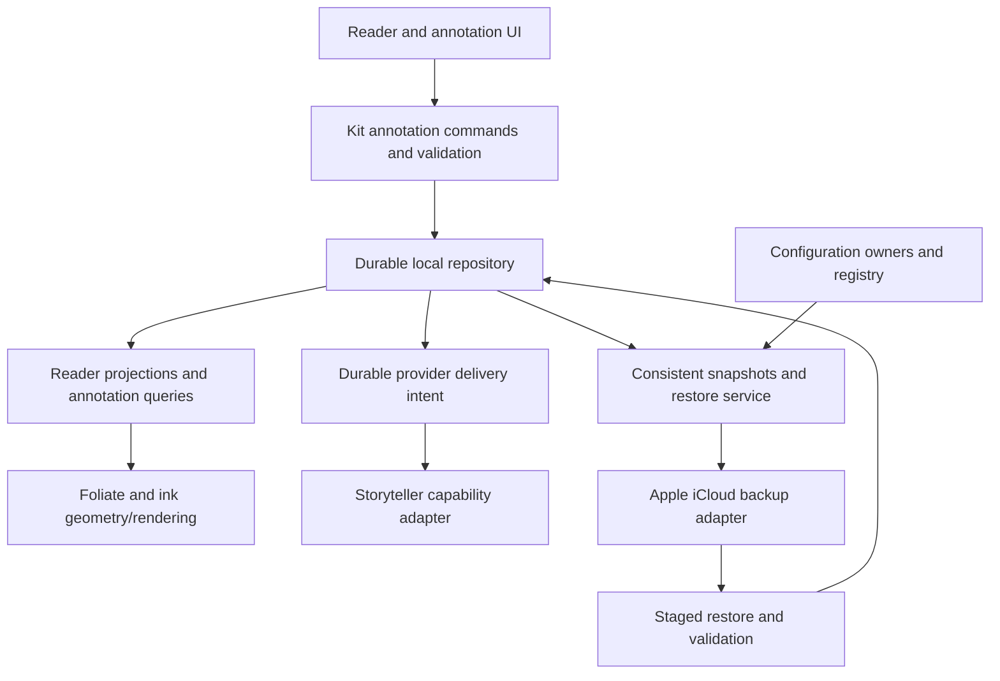

# EPUB annotation, Storyteller sync, and iCloud backup review

Date: 2026-09-30. Status: architecture review and recommended roadmap; no runtime changes. Scope: the working tree based on `fc4bb9d`, including pre-existing uncommitted Pencil and configuration work. Existing plan validation is historical evidence, not validation performed by this review.

Execution details: [phased implementation plan](ANNOTATION_SYNC_BACKUP_IMPLEMENTATION_PLAN.md). The plan expands this review's delivery sequence into work packages, dependencies, migration/rollback requirements and release gates.

## Feasibility and scope

The goals are feasible, but completing them is a substantial product and data-lifecycle effort, not a drawing overlay plus cloud upload. Keep the portable Swift core and current reader integration. Establish reliable local persistence, identity, and recovery before expanding replication or claiming complete backup.

The primary goal is Scribe-class annotation of EPUBs the app can open: writing attached to passages, reflowing inline notes, expandable margin notes, editing tools, retrieval, export, and reliable recovery. Amazon describes Active Canvas and expandable margins as keeping notes with their text across layout changes. Its newer Scribe offering also includes notebook search and AI features. Those broader capabilities need a separate parity track rather than being silently excluded or treated as prerequisites for a dependable EPUB release. [Amazon annotation overview](https://www.aboutamazon.com/news/devices/kindle-scribe), [newer Scribe scope](https://www.aboutamazon.com/news/devices/new-amazon-kindle-scribe-color).

This is functional parity for this reader, not an assertion of access to Amazon's proprietary book, annotation, or account services. Fixed-layout EPUBs and PDFs need document-coordinate annotation rather than the reflowable-text strategy. Notebook templates/folders, handwriting recognition, and AI assistance expand scope further. Maintain a dated feature matrix with explicit supported document types and platforms before promising “full Scribe functionality.”

Automatic backup means that, once enabled and provisioned, local changes are captured and uploaded without manual exports, with visible pending/failure state and a usable restore. It cannot mean guaranteed uploads while an app is suspended, offline, or out of iCloud quota. Initial focus should be iPad authoring plus Mac/iPhone viewing and recovery; Android/Linux retain portable data and local behavior until their adapters are implemented. Do not imply universal iCloud availability or identical stylus input across platforms.

## Current foundation and gaps

| Area | Observed implementation | Required next capability |
| --- | --- | --- |
| Core boundaries | Kit models/actors and platform facades; AppleKit shells; Foliate renderer through a typed bridge | Preserve these boundaries; add explicit repository and backup contracts |
| Typed annotations | `Highlight` combines bookmark/highlight/typed note, UUID, `BookLocator`, and creation date; `BookmarkActor` persists per-book files | Shared anchor service, revisions and deletion history, reliable save results, common annotation queries |
| Handwriting | `InkSession` owns operations, writing lock, undo/redo; `InkActor` writes JSON; `InkEngine` measures and renders | Durability, richer editing, margin notes, complete annotation browser and recovery UI |
| Pencil tools | Native `PKToolPicker`; custom capture and pressure geometry; pen/highlighter/stroke eraser | Real-device acceptance, intentional gesture rules, selection/move/resize and tool fidelity |
| Anchors | Ink has normalized-text offsets/quotes/context; highlights have CFI/DOM locators; ink overlays are filtered from CFIs | One versioned anchor contract, edition identity, ambiguity detection and manual repair |
| Storyteller | Catalog/assets, progress, statuses, metadata, ratings and collection APIs; separate progress and book-edit queues | Version/permission capability matrix, contract tests, future annotation adapter only where supported |
| iCloud configuration | In-progress allowlisted KVS coordinator with offline outbox, account handling, device-class preferences and local pre-import copy | Complete configuration inventory and historical cloud backup/restore |
| Backup | No complete annotation/configuration snapshot and restore service found in the reviewed paths | Recoverable generations, asset manifests, retention, remote completion evidence, restore UX |

Relevant implementation: [ink model](../SilveranKit/Sources/Kit/Models/InkModels.swift), [ink store](../SilveranKit/Sources/Kit/Actors/InkActor.swift), [ink session](../SilveranKit/Sources/Kit/Reader/InkSession.swift), [highlight model](../SilveranKit/Sources/Kit/Models/HighlightModels.swift), [bookmark store](../SilveranKit/Sources/Kit/Actors/BookmarkActor.swift), [anchor resolver](../SilveranKit/Sources/Kit/Resources/WebResources/InkAnchoring.js), [Storyteller client](../SilveranKit/Sources/Kit/Actors/storyteller/StorytellerActor.swift), [configuration scope](ICLOUD_CONFIGURATION_SYNC.md).

### Priority data-integrity findings

These are code-review findings, not implemented fixes or confirmed reports of user data loss.

1. **High: save completion does not establish durable annotation storage.** `InkActor.setSection` updates its cache before saving; `save` catches errors and returns no result. `BookmarkActor` similarly updates memory and notifies after a save helper that swallows errors. `InkSession.flush` waits for tasks whose persistence failures are not propagated. A disk-full or permissions failure can leave visible work absent after restart. Introduce a throwing/result-bearing commit contract and recoverable pending state; optimistic rendering is fine, but “saved” and publication require durable success.
2. **High: tolerant decoding can silently discard original ink.** `BookInk` and `SectionInk` decode collections with `try? ... ?? []/[:]`; invalid elements can empty a containing collection. Unknown tools/kinds become known defaults and missing IDs are regenerated. `InkActor` treats a whole-file decode error as empty and writes the current schema on later edits without rejecting future versions. A subsequent save can replace data the app did not understand. Existing `InkModelsTests` explicitly expect a wrongly typed section to become empty. Distinguish absent optional fields from corruption, retain original bytes, quarantine unsupported records, and prevent destructive writeback until recovered. Upgrade those tests with the eventual fix.
3. **High: present files are not a multi-device merge model.** Whole-book ink files and highlight arrays lack a durable common revision/outbox/tombstone contract; strokes have no stable IDs. Uploading them with last-writer-wins can erase independent edits or resurrect deletions. Add per-annotation revisions and deletion semantics before live annotation synchronization; use immutable backup snapshots independently.
4. **High for edition replacement: anchoring can select a plausible but wrong occurrence.** `resolveAnchor` accepts matching text at an old offset, then chooses the nearest contextual or quote-only match. Repeated passages after text edits can silently misattach ink. A section href is not a universal edition identifier, and source-scoped `BookID` does not itself link replacement books. Add content/edition evidence and ambiguity outcomes; retain unresolved items with an accessible repair action. Never auto-merge books by title.
5. **Capability gap: settings sync does not protect the requested data set.** The configuration feature explicitly excludes annotations, source connections, smart-shelf definitions, and credentials. Its `configurationSync.backup` is a local safety copy, not remote history. Per-device ink-tool preferences also need inventory. Do not advertise full backup until restore covers the complete declared scope.

The annotation browser currently exposes bookmarks and highlights; orphan IDs in `InkSession` are not a complete user-facing handwriting recovery system. The Pencil implementation plan records M5/M6 and device acceptance as unfinished. These are meaningful remaining product work, not cosmetic polish.

## Recommended architecture

This describes intended responsibilities; the repository, snapshot service and backup adapter are proposals. Live iCloud annotation sync is an optional subsequent capability, not a prerequisite for the user's backup goal. If added, it consumes the repository/outbox and must remain separate from retained recovery history.

### Domain and persistence

- Introduce an annotation repository behind the existing actors/session APIs. Share identity, anchors, lifecycle metadata and queries across bookmarks, text highlights, typed notes, ink marks and handwritten notes, while retaining distinct typed payloads. Do not force every annotation into one unstructured JSON blob or rewrite unrelated library/playback storage.
- Give annotations stable IDs, schema version, revision/parent revision, creation/update metadata, source/account ownership, target edition, and explicit deletion tombstones. If merging strokes independently, add stable stroke IDs and defined ordering. Preserve incompatible payloads unchanged. Human timestamps are useful metadata, not sufficient causal ordering.
- Before applying concurrent remote edits, replace or constrain the current section-snapshot undo semantics: undo should reverse the user's operation against the current revision without erasing unrelated incoming work. Define delete-versus-edit recovery and retain tombstones until the replica/retention policy makes collection safe.
- Prefer a transactional local store for annotation records, pending provider operations and snapshot generation metadata. SQLite is the leading candidate because these changes need to commit together; its documented transactions provide all-or-nothing updates. Select a maintained Swift access layer only after testing all supported build targets. Atomic JSON remains reasonable for simple exports or small isolated configuration, but a collection of atomic files is not a cross-file transaction. [SQLite transaction guarantees](https://sqlite.org/transactional.html).
- Decide the engine in an ADR comparing a transactional database with a recoverable file journal. Do not move an active database file into an iCloud Drive folder and expect correct replication. Capture consistent logical snapshots or use the chosen database's supported backup mechanism.
- Migrate ink V1/V2 and highlights V2 through fixtures and explicit version dispatch. Retain originals and a rollback path; validate counts, IDs, anchors and payload checksums before switching reads. One writer owns each domain during transition. A downgrade must refuse unsafe writes or use a compatible export.

### Book identity and anchor service

Preserve the existing `(sourceID, book UUID)` invariant. Add recoverable source descriptors/account bindings and explicit links between assets/editions of a logical book. A file hash identifies exact bytes; a normalized content fingerprint assists matching; neither replaces explicit edition mapping. Keep annotations associated with unavailable or removed books and offer relinking rather than deleting them when downloads or catalog entries disappear.

Use a composite anchor: edition/content identity, section identity/href, CFI where applicable, normalized text position, exact quote and surrounding context. Version the normalization and define offset units (JavaScript UTF-16 versus Swift text indexing), Unicode handling, whitespace and excluded nodes. Model quote/position selectors after the established Web Annotation concepts without assuming other readers support our ink format. [W3C selectors](https://www.w3.org/TR/annotation-model/#selectors).

Resolution returns exact, confidently remapped, ambiguous, or unresolved. Retain the original target and remap provenance. A reader must be able to view/export an orphan's ink and quotation without the original EPUB. Renderer-injected notes must not alter saved CFIs, text selection, search results or media-overlay targets. Page numbers and rectangles remain derived layout data.

### Drawing and reflow

Keep Foliate unless representative EPUB failures justify an engine evaluation. Its rendering and annotation facilities are already integrated; replacing it would add substantial migration and regression work. Put extensions behind a small adapter and run compatibility fixtures when updating the pinned fork. [Foliate upstream](https://github.com/johnfactotum/foliate-js).

Use platform drawing functionality where it fits. The app already uses PencilKit's palette, but custom capture/geometry means it does not automatically receive the complete `PKCanvasView` editing experience. Evaluate a bounded PencilKit canvas for note bodies and margin panels; keep text-anchor resolution and reflow marks as custom domain functionality. `PKDrawing` supports stroke access, serialization and image rendering, but choosing it requires a version/fallback policy and portable representation for non-Apple readers. Do not replace editable originals with thumbnail images or assume conversion is lossless. [Apple drawing model](https://developer.apple.com/documentation/pencilkit/pkdrawing-swift.struct), [ink compatibility](https://developer.apple.com/documentation/pencilkit/supporting-backward-compatibility-for-ink-types).

Keep immediate stroke preview local and fast; keep durable operations serialized. Measure Pencil latency, stroke settling/reflow time, long-chapter indexing, large-book memory, background flush behavior and battery use on devices. A recognizer accepting only Pencil touches is not proof of complete palm rejection: finger navigation, resting hands, page curls and read-aloud turns must be tested together.

## Functionality needed for annotation parity

| Capability | Required outcome | Delivery position |
| --- | --- | --- |
| Basic reading annotation | Bookmarks, highlights, typed notes and ink use consistent navigation, editing and retrieval | Strengthen existing features |
| Inline handwriting | Notes stay with passages across font, spacing, orientation and column changes; move/resize without changing meaning | Complete current foundation |
| Margin notes | Expand/collapse a writable margin; anchor to passages; several notes can coexist and survive narrow screens | New domain/UI work |
| Drawing tools | Pen/highlighter styles, width/color, pressure, erasing, undo/redo, lasso selection, move/resize/copy | Native tools where suitable; deliberate custom remainder |
| Intent and gestures | Predictable write/select/navigate behavior; correct misclassified marks; no accidental turns or lost strokes | Device acceptance gate |
| Annotation library | Combined browse/search/filter, thumbnails, quotations, chapter navigation, orphan/conflict recovery, accessible controls | Required for usable accumulated notes |
| Export and portability | Versioned lossless archive, text/Markdown notes, SVG/PDF/image views with context; clear editable versus flattened outputs | Required for ownership and recovery |
| Edition continuity | Ebook/readaloud mapping, replaced EPUBs, missing books, repeated text, manual relink | Data-integrity gate |
| Accessibility | VoiceOver/keyboard navigation, scalable controls, contrast, text alternatives and optional transcription | Part of each feature |
| Fixed-layout/PDF | Separate page-coordinate targets, transforms, zoom and export rules | Separate document-format milestone |
| Broader Scribe parity | Notebooks, pages/templates/folders, handwriting recognition/search, optional AI refinement or summaries | Separate roadmap; original ink always retained |

Handwriting recognition must keep recognized text as a derived, correctable layer with provenance. AI features must not rewrite originals or send private notes to a third party without an explicit product/privacy design. These capabilities should not delay basic reliable capture and restore.

## Storyteller interoperability

The existing client supports much of the useful server interaction already. Build on `StorytellerActor`, `ProgressSyncActor`, `BookEditSyncActor` and the source capability model rather than adding network calls to annotation views.

Public 2.x documentation still describes notes/highlights/bookmarks sync as forthcoming. The current client has no such endpoints. A read-only inspection of upstream `main` at `b829827ae1b2135bda0ce166243c23778944c0a5` found book positions/status/rating routes and user settings, but no annotation-named route in the inspected v2 book/user trees. This is bounded evidence, not proof about every route, beta, plugin or deployed server. Published documentation also lags capabilities such as ratings. [Published feature scope](https://storyteller-platform.dev/docs/managing/organizing/), [inspected upstream API tree](https://gitlab.com/storyteller-platform/storyteller/-/tree/b829827ae1b2135bda0ce166243c23778944c0a5/applications/web/src/app/api/v2).

| Data | Integration policy |
| --- | --- |
| Reading/listening position | Preserve existing locator and queue handling; test ebook/readaloud mapping and concurrent progress policy |
| Reading status, metadata, ratings, collections | Use supported endpoints and user permissions; distinguish shared catalog edits from private user state |
| Highlights, bookmarks, typed notes | No supported round trip established by this review; enable only against a verified server contract/version |
| Handwritten ink, margin layout and Silveran tool state | No verified server contract; keep full-fidelity local data and iCloud backup |
| Source and shelf configuration | Back up local definitions; map to server features only with explicit semantics and stable identities |

Maintain a tested capability matrix by server version, user permission and data type; do not invent a capability-discovery endpoint if none exists. Probe only through safe supported requests. Distinguish unsupported, unauthorized and temporarily unavailable. Keep provider IDs, revisions and cursors separate from domain IDs, and preserve data the provider cannot represent.

For a future annotation adapter, specify create/update/delete, pagination, concurrency, retry/idempotency and lossless field mapping. Importing a provider event must not echo it back as a new edit. If Storyteller and iCloud ever both replicate annotations, converge through the same local revisions and provider mapping; never run two unrelated last-writer-wins pipelines. Retain both creative revisions on unresolved conflicts. Delete-versus-edit needs an explicit recovery policy. Old backup outboxes must never replay destructive remote commands automatically.

## Automatic iCloud backup and restore

### Scope and policy

Create a reviewed configuration/data inventory with an owner, schema, backup inclusion, sync scope, restore/apply rule, and sensitivity for each item. “Local to this device” does not automatically mean “excluded from backup.”

| Category | Backup/restore requirement |
| --- | --- |
| All annotation forms | Include editable strokes, notes, highlights, bookmarks, anchors, revisions, tombstones, orphans and unresolved conflicts |
| Reading identity/context | Source descriptors and stable IDs, book/edition mapping, quotations and sufficient metadata to locate missing media; progress snapshot with safe reconciliation |
| User configuration | Themes, fonts/preferences, palettes, Pencil tools, per-book overrides, shelves, sidebar/home definitions, layouts and automation/sync preferences that exist in the app |
| Device-specific preferences | Preserve under device/class scope; apply only when compatible or explicitly selected during restore |
| Credentials and folder grants | Separate secure credential policy; no tokens/passwords in generic JSON. Preserve reconnection intent; prompt for login/folder authorization when required |
| Fonts and other required user assets | Include permitted user-owned assets or record an explicit missing dependency and fallback; never silently report a complete restore without them |
| EPUB/audio files and caches | Full media-library backup is a separate scope decision. An annotation/configuration backup must clearly state when originals must be reobtained |

### Transport choice

Keep existing KVS as a bounded preference-sync feature. It is not suitable for the growing annotation payload/history, and it does not provide a backup completion receipt. Backups may include those preferences as historical snapshots; restoration must not automatically publish old preferences into live KVS.

Recommend evaluating a private CloudKit database with immutable snapshot manifests and assets for backup, plus app-owned local storage. `CKSyncEngine` is appropriate if record synchronization is also introduced: Apple exposes persistent engine-state updates and account-change events, while application storage and merge policy remain our responsibility. Its availability fits the current Apple deployment floors. Scheduling is opportunistic, not a delivery deadline. [Apple sync sample](https://github.com/apple/sample-cloudkit-sync-engine), [state persistence](https://developer.apple.com/documentation/cloudkit/cksyncengine-5sie5/event/stateupdate/stateserialization), [account changes](https://developer.apple.com/documentation/cloudkit/cksyncengine-5sie5/event/accountchange).

The alternative is versioned archive packages in iCloud Drive, useful for user-visible files and export. It needs coordinated file access, download/eviction handling, conflict handling and truthful upload status. Decide CloudKit versus Drive in an ADR/prototype based on restore behavior, portability, quota, signing and operational complexity; do not implement both cloud systems without a concrete need. Retain a portable manual export regardless of transport.

### Backup protocol and acceptance

1. Commit locally first. Capture a consistent generation across annotation records and configuration owners, using a transaction or coordinated versioned capture; record any unavailable component instead of silently omitting it.
2. Create a versioned manifest with snapshot ID, source device/account scope, schema versions, record counts and content hashes. Include all referenced immutable assets. Deduplicate unchanged payloads rather than uploading a whole book after every stroke.
3. Persist pending backup work before upload. Schedule coalesced backups after edits and on launch/foreground/background opportunities; resume interrupted work with bounded retries. Account changes isolate pending work and require deliberate reconciliation before uploading retained data to a different account.
4. Upload assets before declaring the manifest complete. Record remote completion only after required writes succeed. Distinguish locally saved, backup pending, remotely complete, and restore verified. Expose last successful recovery point, remaining work and actionable quota/authentication errors.
5. Retain multiple immutable generations independently of live deletions. Set a documented age/count/storage policy and protect the last known-good recovery point. Garbage-collect assets only after checking references from all retained manifests. A mutable “latest” pointer is a convenience, never the sole discoverability mechanism.
6. Offer a backup browser and staged restore: download, verify hashes/completeness/schema, preview counts/missing books, capture a pre-restore local backup, then import atomically. Default to recover/merge with existing local data; make replacement explicit. Keep conflicting versions and orphaned notes recoverable.
7. Rebind sources, credentials and platform paths safely. Rebuild renderer/search caches. Reconcile restored progress and server edits against current remote state instead of replaying stale queues. Publish restored preferences or annotations to live sync only through deliberate domain operations.
8. Prove recovery on an empty installation and on a populated device. Verify editable payloads as well as counts, settings, identity and attachment contents. Interrupted uploads and corrupt/missing assets must never appear as complete restore points.

This cannot guarantee recovery of changes that never left a lost device, indefinite retention, or protection after the user deletes the cloud account. State those boundaries in the backup UI alongside current protection status, not as an excuse to omit automatic retries and recovery.

## Delivery sequence and release gates

| Stage | Deliverable | Exit evidence |
| --- | --- | --- |
| 1. Contracts and baseline | Dated parity matrix; annotation/config inventory; identity, storage and backup ADRs; representative EPUB corpus | Every persisted category has an owner and restore policy; risks above have scoped follow-up work |
| 2. Durable annotation core | Error-aware repository, protected decoding, migrations, revision/tombstone model and lossless local archive/restore | Failure injection, restart, malformed/future data and migration/rollback tests pass without losing originals |
| 3. Automatic iCloud recovery | Chosen adapter, complete snapshots, retention, account isolation and restore UI | Signed Mac/iPad/iPhone tests, offline/quota/interrupted uploads, fresh-install and populated-store restores |
| 4. Complete EPUB experience | Shared anchors, annotation browser, margin notes, richer editing and accessible export | Real Pencil and reflow corpus acceptance; repeated-text ambiguity and cross-edition repair tests |
| 5. Verified interoperability | Versioned Storyteller contracts; existing sync hardening; annotation sync only if supported | Contract tests against supported server versions, concurrent edits, retries, deletion and source/account isolation |
| 6. Broader parity | Fixed-layout/PDF, notebooks, recognition and optional AI; additional authoring platforms | Separate feature/platform acceptance, performance and privacy criteria |

Stages 3–5 can overlap after the contracts and durability work settle; backup need not wait for richer drawing tools or upstream annotation APIs. Avoid a large rewrite: wrap current stores first, migrate one domain at a time, and keep shipped behavior usable. Treat this as a multi-milestone effort over months, not the earlier ink MVP's 4–5 week estimate; credible staffing estimates require the storage and native-canvas prototypes plus real-device results.

The test matrix should cover disk-full/write failures; process death at commit/upload/restore boundaries; old/future/corrupt schemas; duplicate delivery; simultaneous edits and delete-versus-edit; wrong-account callbacks; quota; missing EPUBs and assets; source removal; ebook/readaloud replacements; repeated text and Unicode; portrait/landscape/multicolumn/scrolling; dark themes; Pencil/palm/finger/read-aloud interaction; and accessible recovery controls. Use existing `scripts/test` and the WebHarness `npm test` suite, appropriate platform build scripts, plus signed device tests. Do not treat fake layout or fake cloud success as those device checks.

## Review validation and limitations

Inspected architecture/contributing guidance, package boundaries, annotation models/stores/session/anchor code, annotation UI, source identity/capabilities, Storyteller routes/queues, configuration implementation and existing tests/plans. Consulted Context7 for CloudKit; Storyteller and PencilKit had no relevant Context7 result, so official docs/source supplied the fallback. Read upstream Storyteller through its public repository API at the commit above; did not access or modify a personal server.

Only documentation was changed for this review. `git diff --check` passed, and a Python check of Markdown links across all six changed/new documentation files found no missing local targets. App builds, runtime tests, fault-injection reproductions, real Pencil acceptance and real-account iCloud restore were not performed. No production-ready backup or sync claim is made, and no bugfix entry is added because no runtime bugfix was implemented. Existing uncommitted work and its validation status remain intact.
