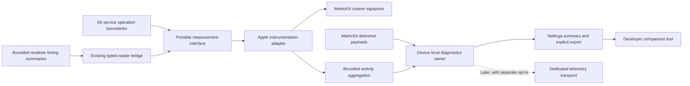

# Energy diagnostics and developer reporting implementation plan

Date: 2026-10-03. Status: **ED-0/ED-1 and ED-3/ED-4 local code implemented; ED-2 selective coverage implemented with listed gaps. Automated verification is recorded below. iPhone simulator usability passed after fixing BF-083/BF-084; iPad simulator interaction and ED-5 device/energy acceptance remain open; ED-6 is deferred.** Canonical backlog: [phased implementation plan](ANNOTATION_SYNC_BACKUP_IMPLEMENTATION_PLAN.md), cross-phase energy diagnostics (ED-0–ED-6).

## Outcome and handoff

Give developers evidence of how Silveran's resource consumption changes over time and which operations warrant investigation for battery drain. Combine daily operating-system reports, named operation measurements and reproducible real-device profiling. A report must distinguish measured resource consumption, observed activity and inferred energy impact; it must never invent exact battery percentages or joules per feature.

The owner requested this capability and an implementation plan on 2026-10-03. The design defaults below are recommendations for implementation, not claims that the owner separately selected retention limits, telemetry consent or a hosting provider. The implementing agent can proceed with the local-first increment without provisioning a service. Automatic submission and a hosted dashboard remain a separate delivery stage.

**First deliverable:** ED-0 through ED-5: an iPhone/iPad collector, bounded local history, selective operation instrumentation, a user-controlled export, a developer report comparison tool and a real-device baseline. Start ED-0–ED-4 while arranging ED-5 hardware access. If hardware is unavailable, finish independent implementation and automated checks, list exact pending checks and retry; keep energy/interaction acceptance open.

Read [AGENTS.md](../AGENTS.md), [architecture](../ARCHITECTURE.md), [contributing](../CONTRIBUTING.md), [annotation/sync/backup review](ANNOTATION_SYNC_BACKUP_REVIEW.md), [ADR 014](decisions/014-active-file-persistence-and-measurement-gates.md) and [existing persistence measurements](ANNOTATION_PERSISTENCE_MEASUREMENTS.md). Preserve all current worktree changes. Changes to save, sync or backup scheduling are not part of adding measurement; any subsequently discovered optimization is a separate, evidence-backed bugfix with its own `BUGFIX_LOG.md` entry.

## Baseline observed during planning

- The package supports iOS 18 and macOS 15. Do not raise minimum OS versions to add diagnostics. Initial runtime acceptance is iPad/iPhone; other platforms keep compiling and receive a no-op implementation unless explicitly supported and verified.
- `SilveranPlatform` and `bootstrapApplePlatformDefaultsIfNeeded()` provide the existing Kit/platform injection boundary.
- `DebugLogBuffer` is a bounded in-memory text log with verbose performance categories; it is not a durable resource time series or a safe general telemetry payload. `SettingsView` already includes an iOS debug-log screen and sync diagnostics.
- `SyncActivityLog` is a separate persisted sync history. Reuse the underlying operation boundaries, not its free-text records or store as the energy report format.
- The persistence measurement harness exercises synthetic annotation saves, reconciliation and backup and produces numeric evidence. Host timings do not establish device battery cost.
- A search of Swift sources found no `MetricKit`, `OSSignposter`, `os_signpost` or `mxSignpost` integration. Recheck the live implementation branch before introducing new owners.

## Measurement strategy and limits

| Evidence source | Useful answer | Limit that must remain visible |
| --- | --- | --- |
| MetricKit daily payloads | Has app CPU/GPU activity, disk writing or network transfer changed across builds/device cohorts? | Delayed, optional and aggregate; not a continuous energy trace or precise per-function energy meter |
| MetricKit custom signpost intervals | Which named operations are frequent, slow or associated with resource use? | Resources during overlapping intervals are not exclusive attribution; supported fields may be absent |
| Silveran bounded activity summaries | What ran, how often, how much work, with what outcomes, and in which lifecycle/mode context? | Counts and elapsed time are not energy; process termination may leave partial windows |
| Instruments Power Profiler plus CPU/network traces | What work coincides with power impact during a reproducible scenario? | Real-device/OS capability and recording conditions matter; power-impact values are model-dependent |
| Xcode Organizer, when sufficient distribution data exists | Are foreground/background battery trends regressing across releases? | Availability depends on Apple's collection, distribution and sample coverage; not the initial delivery dependency |

MetricKit's `MXMetricManager` API supports the current iOS minimum. Use API availability checks and the installed SDK; current Apple documentation also describes newer `MetricManager` APIs that must not become an unconditional dependency. Power Profiler requires iOS/iPadOS 26 or later. Maintain an explicit OS/SDK/platform capability matrix during ED-0, including each optional metric and diagnostic type. Do not promise high-energy diagnostics or newer state-reporting APIs on older systems.

Daily reports cover approximately the preceding 24 hours and arrive at most daily per metric source; more than one source payload can arrive. Delayed delivery is normal. Use payload report times and metadata, not the app's receipt time/build, when attributing the observation. A payload spanning multiple app versions must be labeled mixed-version and excluded from clean build comparisons unless it supports a defensible split.

Battery level, charging, low-power and thermal state are context only. If collected, use available notifications/lifecycle snapshots instead of periodic battery polling. Do not convert device battery drop into app-specific consumption. Foreground/background and reader/audio activity durations need documented overlapping semantics: audio can run while reading, and daily app CPU cannot be assigned to a reading mode merely because its duration is known.

## Ownership and data flow

- **Kit:** a small `Sendable` operation vocabulary/interface, value-only counters and outcomes, and portable report validation/aggregation where useful. Names below are proposed, not existing types. Use a no-op default; no imports of MetricKit, UIKit, CloudKit or `os` in the core contract. Prefer existing injection conventions over a second global service registry.
- **AppleKit:** one app-lifetime collector/subscriber, signpost adapter, bounded diagnostics store, export lifecycle and settings presentation. Subscription belongs to startup/lifecycle ownership, not view appearance. Wire it so diagnostics initialization failure cannot delay protected restore admission, annotation saving or app launch.
- **Renderer:** measure only renderer work using monotonic browser durations and report coarse completed operations through a validated bridge. JavaScript owns no diagnostic files, upload client or annotation persistence. WebKit can execute in separate processes: app-process metrics may miss renderer work; verify process coverage in traces and document it.
- **No new durable mutation path:** instrumentation wraps existing owners and observes outcomes. No telemetry write is part of an annotation transaction. Bounded nonblocking enqueue/drop is acceptable for diagnostics; blocking a save or spawning unbounded tasks is not. Any disk work happens away from drawing/main-thread hot paths.
- **Background:** use existing execution opportunities; no timer or background entitlement whose purpose is keeping the app alive to measure it. Flush opportunistically with bounded work. A crash or suspension may lose recent diagnostic counters, and exports must state that limitation.

ED-0 must add an ADR using the next free number. Cover owner/lifecycle, the disposable diagnostics store, alternatives (Organizer alone, text logs, third-party SDK), OS availability, privacy, failure behavior, overhead, rollback and cross-platform scope. Update `ARCHITECTURE.md` only as implementation changes its current shape. No annotation engine, identity, conflict policy or cloud authority changes are authorized by this plan.

## Report contract, retention and privacy

Use a versioned export bundle with a manifest, a sanitized normalized metrics file and a short human-readable summary. It must be usable offline by the developer comparison tool. Retain original OS payload bytes locally when safe and useful for forward compatibility, but do not blindly export them: inspect actual payload fields, use an explicit export allowlist, and treat device names, paths, identifiers and diagnostic strings as potentially identifying. Diagnostic stacks, if later included, need separate handling and matching symbol files; they are not required for the first metrics export.

| Data group | Required fields/semantics |
| --- | --- |
| Envelope | Schema and instrumentation version; random report ID; UTC creation time; report-source type; capture interval; receipt time separately; completeness/coverage and dropped/evicted counts |
| Build/environment | Payload app version/build, observed build transitions, platform, OS version, device model; simulator/development/distribution provenance where known; unavailable values explicit |
| OS measurements | Supported CPU time/instructions, GPU time, logical disk writes, network transfer by supported connection class, runtime and other reviewed metrics, each with units, source, interval and availability |
| Operations | Static operation name/category, count, success/cancel/failure/incomplete counts, duration histogram with documented bucket bounds, finite workload counters, sampled/unsampled status and optional interval resource fields |
| Context | Observed lifecycle durations and finite activity labels, coverage boundaries, low-power/thermal/charging context where available; never imply unsampled continuous knowledge |
| Quality | Disabled/unsupported/missing/corrupt/oversized/partial states; source-specific deduplication identity; report-period overlap; mixed-version flag; schema compatibility |

Use monotonic clocks for durations and UTC wall time for report boundaries. Never subtract wall timestamps to measure operations. Bound operation cardinality, outstanding spans, queues, histograms and payload sizes. Balance spans across success, cancellation and exceptions; a lost end event is incomplete, not an infinitely long successful operation. Unique span tokens must distinguish concurrent operations with the same static name. Specify whether counters and nested spans are inclusive; the comparison tool must not add overlapping resource measurements into a purported app total.

Proposed starting limits: retain at most 30 days and 20 MiB of local diagnostic data, whichever limit is reached first; maximum accepted individual OS payload 5 MiB; maximum 1,024 pending events and 256 open spans. Enforce bounded serialization/ingress as far as the framework allows; record an explicit drop reason when a limit is reached. These are engineering defaults to confirm against fixture/device measurements in ED-0/ED-5, not observed production requirements. Evict oldest diagnostic records only; never traverse or prune annotation/recovery directories. Process in bounded batches and coalesce disk writes; avoid one write per event. Exports use a bounded snapshot and temporary files with defined cleanup on cancel, completion and next launch.

Local collection defaults to on with a visible off switch; external submission defaults to off and does not exist in the first increment. Explain the local collection on the diagnostics screen. Turning collection off stops Silveran's subscriber/instrumentation and discards pending in-memory events; it cannot promise to disable the OS's own analytics. Retained history remains until cleared or expired. “Clear history” removes stored reports and queued exports under this owner, increments a local generation to prevent already-running jobs from repopulating them, and warns that previously shared copies cannot be recalled. Avoid reimporting already-cleared historical payloads. With collection still enabled, fresh observations can accumulate afterward.

Exclude book/author titles, filenames, paths, quotations, note/stroke contents, source/account IDs, server URLs, request bodies, credentials and arbitrary error descriptions. Use static failure categories and coarse size/count buckets when exact sizes create unnecessary specificity. Session correlation tokens are local/short-lived and reset on clearing; do not add a permanent cross-app or cross-device identifier. Do not append existing debug/sync logs automatically.

Telemetry payloads, export staging and any future upload queue are excluded from Silveran archives, iCloud sync and device backup where the platform supports exclusion. Collection/submission preferences are device-local and excluded from configuration sync/restore; a restored device must not inherit permission to upload. Record exact fields and exclusions in the [configuration inventory](ANNOTATION_CONFIGURATION_FIELD_INVENTORY.md) and test them. Diagnostics are deliberately disposable and separate from irreplaceable user data. Corrupt/future records may be quarantined within the cap or dropped with an explicit count; neither affects annotation recovery.

## Initial operation vocabulary and integration sites

Keep names static and backend-neutral. Recheck exact functions in the current tree; this table identifies owners, not permission to rewrite them. Workload context must use finite allowlisted fields, never identifiers as operation names.

| Category / suggested names | Existing integration area | Useful workload/outcome evidence |
| --- | --- | --- |
| `reader.open`, `reader.chapterLayout`, `reader.reflow` | `ReadingSession`, `ReaderCommsBridge`, Foliate manager and layout modules | Open/layout counts, content-size bucket, elapsed time, cancelled/failed/complete; mark native vs renderer coverage |
| `annotation.commitInk`, `annotation.commitHighlight`, `annotation.reconcile` | `InkSession`, protected `InkActor`/`BookmarkActor`, local mutation/recovery owners | Commit count, changed stroke/section buckets, bytes explicitly written by the owner, outcome; distinguish application payload bytes from OS logical writes |
| `annotationSync.fetch`, `annotationSync.apply`, `annotationSync.send` | `AnnotationSync`, `AppAnnotationSync`, `AnnotationCloudSync`, record receiver | Changed-record counts, retries/backoff, empty fetches, outcome; no cloud/account identifiers |
| `backup.capture`, `backup.compress`, `backup.upload` | `BackupService`, `CloudBackupCoordinator`, `AppBackup`, Apple transport | Archive-size bucket, counts, durations, bytes transferred where observable, retries; capture failure remains a backup failure independent of telemetry |
| `source.refresh`, `source.download`, `readingState.sync` | `BookSourceActor` boundaries, `BookServiceActor`, download owners, `ProgressSyncActor`/`ProgressUploadManager` | Requests, transferred bytes, progress updates, retries/empty checks; use capabilities, no new shared Storyteller casts |
| `audio.prepare`, `audio.positionUpdate`; audio-active duration | Playback owners, `MediaViewModel`, read-aloud coordination | Active duration, coarse update counts, seek/prepare counts; no per-audio-buffer or per-highlight-tick signpost |
| `library.index`, `library.coverProcess` | Existing indexing/cover owners | Item-count/size buckets, cache hits/misses and completed batch timings |

Prioritize save/reflow/sync/backup in ED-2, then reader/audio/library coverage before ED-5 final baseline. Include failures and no-work outcomes: excessive polling can drain energy even when zero records change. A long audio session is a context duration, not one long custom interval with misleading exclusive resource attribution. For frequent operations, aggregate counters and sample durations using a documented rate/denominator; do not extrapolate sampled OS resource totals as if exact.

## Work packages and acceptance

| Package | Deliverable | Depends on | Current status |
| --- | --- | --- | --- |
| ED-0 | Inventory, ADR, API matrix, report contract, defaults and fixtures | Existing architecture/integrity rules | Implemented; delivery qualification pending |
| ED-1 | Collector, no-op contract, store, lifecycle and configuration policy | ED-0 | Implemented; device payload pending |
| ED-2 | Named operations and bounded renderer/native activity summaries | ED-1 | Partial coverage implemented; see evidence gaps |
| ED-3 | Diagnostics screen and shareable report | ED-1; ED-2 for full coverage | Implemented; UI usability pending |
| ED-4 | Offline developer comparison tool and documented workflow | ED-0 contract; ED-1–ED-3 integration | Implemented; physical export input pending |
| ED-5 | Real-device baselines, overhead qualification and regression gates | ED-1–ED-4; hardware availability | Planned |
| ED-6 | Opt-in automatic delivery and hosted developer trends | ED-0–ED-5; service/retention decisions | Later, not part of first increment |

### ED-0 — Freeze the measurement contract

Inventory existing logging, metrics, lifecycle and report-export paths on the implementation branch. Record branch/commit and any dirty-state qualification; do not treat this planning snapshot as a reproducible benchmark build. Use Context7 and primary Apple documentation to verify the API/OS matrix, signpost resource semantics and on-device collection requirements against the installed SDK. Check whether the installed distribution/signing mode receives real daily payloads; Xcode-generated samples do not establish this.

Write the ADR and schema fixtures (normal, duplicate, partial, missing, future version, corrupt, oversized, mixed builds and multiple sources). Define the export allowlist, histogram buckets, no-op behavior and operation coverage. Reuse Foundation and existing archive support where appropriate; introduce no analytics SDK or storage dependency without a documented need. **Exit:** reviewers can identify every owner, data field, limit and failure path; fixtures describe testable semantics.

### ED-1 — Collect and retain locally

Implement the injected portable interface and platform adapter, one retained MetricKit subscriber, payload ingestion and a dedicated bounded store. Preserve known payload provenance and original bytes locally subject to privacy/size review. Deduplicate repeated delivery by stable payload identity or a documented digest including source and interval; do not deduplicate merely by calendar date or combine distinct sources as independent app totals. Handle changes of build during a report period and past-payload delivery after restart.

Keep framework callbacks short; serialize work off the main actor. Treat absent metrics as unknown. Add current state (`collecting`, `disabled`, `unsupported`, `awaiting report`, `storage error`) and last successful receipt, without claiming a report is due at a guaranteed time. Implement retention, lifecycle cancellation, clear-generation handling, and device-local preference/exclusion policy. **Exit:** injected payloads survive restart, duplicates are suppressed, bounds hold, disabled/failed telemetry cannot change annotation behavior, and all supported build targets retain the no-op path.

### ED-2 — Instrument the actual owners

Implement the vocabulary above behind existing service boundaries, using MetricKit log handles/helpers for custom intervals requiring resource measurements. Measure the full intended async operation, not only task creation; distinguish queued time from running time when observable. Finish spans on cancellation/error without altering those outcomes. Batch renderer observations through the typed bridge, with size/rate/field validation, view-generation checks, and a renderer-local duration rather than subtracting native and JavaScript clock values.

Document every instrumented operation's start/end, nesting, sampling, workload fields and platform coverage. Add counters for attempts, retries and empty work. **Exit:** representative synthetic workflows produce the expected operation counts/timings with no content leakage or duplicate observations; an Instruments trace shows recognizable markers. Any uninstrumented area stays explicitly listed as a coverage gap.

### ED-3 — Make reports accessible

Add “Performance diagnostics” in Settings with collection status, retained date range, storage use, last report received, **Export performance report**, and **Clear history**. Explain that reports contain resource/activity measurements and may take a day or longer to become available. Use the platform share/save flow; generating/exporting a report is not sending it to developers. Sharing cancellation leaves collection and retained history intact.

Support an empty export with explicit coverage information if local operation summaries exist but no OS payload has arrived. Disable export only when there is genuinely nothing exportable, with a readable reason. Show preparation/storage failures without claiming success; no progress percentage unless total work is known. Export a consistent bounded snapshot while collection continues. Provide a human-readable summary plus machine-readable data; no account, network connection or iCloud setup required. **Exit:** actual iPad and iPhone simulator workflows pass export/open/clear/off-on/error/cancel, narrow layout, large text and accessibility checks, with evidence. Physical-device share-file verification remains part of ED-5.

### ED-4 — Turn exports into developer evidence

Provide a repository-owned command/tool that consumes one or more exported bundles and writes a portable comparison report (Markdown and structured JSON; optional CSV). Choose the smallest supported existing runtime in ED-0. Do not require a hosted service, browser app or a new dashboard framework. Treat archives as untrusted input: limit expansion/file sizes, reject traversal, validate schema/units, and give precise unsupported/corrupt warnings.

Compare by platform, device model, OS, build and instrumentation version with explicit cohort counts/coverage. Report CPU seconds per foreground hour only with a compatible report interval/denominator, and distinguish app-total CPU from CPU measured during a named interval. If foreground/background CPU separation is unavailable, label app-total CPU divided by foreground time accordingly or omit the ratio when misleading; never invent a split. Other useful comparisons: per-operation duration distributions, logical writes per matching measured interval/operation, payload bytes per committed save, retry fraction and empty-check frequency. Daily OS totals cannot be divided by an unrelated subset of sampled operations to assert exact per-operation cost.

Do not average percentiles: merge compatible histograms with their counts or report per-report percentile distributions explicitly. Avoid overlapping report-window double counting. List missing data, sample rates, mixed builds and excluded comparisons. Display high-percentile and typical results with sample counts; label small cohorts as insufficient evidence. Flag large changes for investigation using thresholds fixed after ED-5 baselines; do not label correlation as causation.

**Exit:** fixture comparisons correctly distinguish a seeded regression, increased usage without a per-unit regression, incompatible models, overlapping/duplicate reports and insufficient samples. Document one end-to-end workflow: export → import → compare two builds → identify operation → reproduce with Instruments → repeat after a fix. Retain matching build/symbol provenance for traces rather than promising stack attribution from aggregate metrics.

### ED-5 — Establish real-device evidence and budgets

Use isolated synthetic/public-domain books, disposable annotation stores and dedicated test accounts if signed cloud behavior is exercised. Preserve the owner's existing simulators, annotations, reading positions and credentials. Run optimized builds on a named physical iPad and iPhone; record model, OS/build, app commit/build, instrumentation version, fixture, settings, brightness, battery/charging/thermal/low-power state, network and timing conditions. Older supported OS collection and a Power Profiler-capable device are distinct matrix entries.

| Scenario | Starting protocol | What developers should be able to see |
| --- | --- | --- |
| Idle reader | 10 minutes on a static page, no audio or pending work | Stable idle resource baseline; unexpected repeated layout, polling or writes identifiable |
| Page turns/reflow | Fixed page-turn sequence, rotation and font/layout changes in a large synthetic chapter | Layout count/duration and native/renderer coverage correlated with trace activity |
| Annotation session | Fixed synthetic stroke/highlight/save/reopen sequence, plus real Pencil interaction | Commit/reconcile counts, payload writes, latency and power impact; no integrity or input-quality regression |
| Audio/read-aloud | 10 minutes screen-on read-aloud and separately 10 minutes screen-locked playback | Audio duration, position-update rate, network and CPU context; background playback remains correct |
| Sync | Fixed pending records; offline → reconnect; empty checks; injected/reproducible retries | Useful work separated from retry/empty-work churn; signed cloud delivery separately verified |
| Backup | Small and large synthetic archives with capture/compress/upload separated | Stage cost and bytes without changing backup completeness or scheduling semantics |
| Library | Fixed refresh/index/cover/download workload and warm-cache repeat | Cache effects and repeated work visible |
| Background idle | 10-minute screen-locked interval with no playback or pending work | No telemetry-created keepalive, polling loop or unexpected background writes |

Starting durations are protocol defaults; extend low-signal scenarios when needed. Alternate baseline/instrumented runs on the same device, at least three per condition; report spread, not a single run. Include collector enabled/disabled comparisons and instrumentation with no-op sink where useful to isolate overhead. Record connected/disconnected conditions: Xcode pairing can keep Apple silicon awake, and charging affects system-power reporting. Use disconnected on-device traces for sleep/wake qualification; do not compare a tethered charging run with an unplugged run as if equivalent.

Provisional engineering targets: diagnostic history never exceeds its cap; no per-sample/per-frame disk writes or telemetry-created background wakeups; bounded queues under stress; less than 2% added CPU in a controlled representative workload, less than 1 ms added p95 main-thread operation latency, and less than 5 MiB additional steady-state memory. These are proposed targets, not measured results or proof of statistical detectability. Record absolute values, baseline variability and repeated comparisons; revise noisy/unrealistic targets with dated rationale before declaring acceptance. Energy itself needs a per-device empirical baseline and repeatability threshold; do not invent a universal power-impact score or percentage battery budget.

Add focused repeatable performance checks for confirmed expensive operations (for example CPU, logical work counts or writes) to prevent recurrence. Use existing test infrastructure and real device runs where the metric requires them. Simulator timings are useful for functional checks, not energy qualification.

**Exit:** named-device baseline reports and traces, enabled/disabled overhead evidence, a real delivered daily payload and physical export round trip, plus a successful developer comparison are retained. A sample payload, successful build or simulator run alone cannot close this gate. Signed iCloud scenario acceptance and Pencil/palm quality remain distinct evidence; pending gates must be recorded, not inferred from other successes.

### ED-6 — Later automatic developer reporting

Choose the endpoint owner/hosting, operational budget, authentication/abuse protection, retention/deletion policy, cohort identifiers and distribution/privacy disclosures before deployment. Reuse the export schema, sanitizer and deduplication rules. Add a separately explained opt-in, bounded local outbox, authenticated encrypted transport, idempotent uploads, exponential backoff and server acknowledgement; queueing is not delivery. Turning submission off stops/cancels future sends and clears the pending upload queue according to the disclosed policy; it does not recall reports already received. A restored preference must never silently enable submission.

Batch submissions during permitted execution/network opportunities, honoring constrained/expensive networks and system scheduling. Upload failure, lack of an account or endpoint downtime cannot interfere with local reading, collection or export. Do not send reports to Storyteller, another book server, or the person's annotation/backup CloudKit zones. Build trend views from the ED-4 comparison semantics; validate server-side ingestion and duplicate handling with synthetic reports before a small consenting cohort rollout. **Exit:** end-to-end delivery/opt-out/deletion/failure tests and service ownership are recorded, with energy overhead measured again. First-increment completion does not imply ED-6 completion.

## Verification and evidence record

Each increment records code, automated checks, simulator usability and physical-device/signed-cloud acceptance separately. Keep this matrix and the canonical backlog current:

| Area | Code | Automated | Simulator usability | Real-device / signed service |
| --- | --- | --- | --- | --- |
| Collector/store/configuration (ED-1) | Implemented; BF-083 fixed | Portable + iPhone and iPad components pass (13/13 each) | iPhone passed (context, off/on); iPad pending | Actual OS payload pending |
| Native/renderer instrumentation (ED-2) | Selective coverage; explicit gaps | Portable, WebHarness (229) + iPhone/iPad components pass | Pending | Instruments/process coverage pending |
| Diagnostics/export (ED-3) | Implemented; BF-084 fixed | Local collector ZIP round trip + clear/off/on pass on iPhone and iPad | iPhone passed (export/Files/cancel/clear/large text); iPad, VoiceOver, landscape pending | Physical share round trip pending |
| Developer comparison (ED-4) | Implemented | Six fixture tests pass | N/A, offline tool | Physical exported input pending |
| Baselines/overhead (ED-5) | Protocol only | Not run | Cannot establish energy | Not run |
| Automatic reporting (ED-6) | Later | Not run | Not run | Not provisioned |

Required automated cases include restart/duplicate/multiple-source payloads; report intervals and mixed builds; missing values versus zero; schema evolution, oversized/corrupt input and units; concurrent/cancelled/incomplete spans; bounded queues/cardinality; concurrent clear/export/ingest and preference changes; disk-full/permission failures isolated from successful annotation commits; no-op platform behavior; export allowlist seeded with private sentinel values; archive/configuration exclusion; renderer generation/rate validation; and the ED-4 comparison cases. Telemetry drop/loss is acceptable only with honest coverage and no user-data effects.

Use `scripts/test` for the portable suite. Use `scripts/iostest` with `SILVERAN_IOS_DESTINATION='platform=iOS Simulator,id=<isolated-device-UDID>'` for Apple component tests on explicit iPad and iPhone destinations; the placeholder is replaced with an owned QA device. Inspect result trees/counts for new tests (OD-019), not just the success banner. If stale, clean only the owned generated component project/output and rerun. Run `npm test` in `SilveranKit/Tests/WebHarness` when renderer/bridge JavaScript changes. Use repository build/format scripts for affected surfaces and record exact invocations and unavailable toolchains. Follow the validation-project workaround in AGENTS.md for OD-017; preserve the resolved dependency graph and the user's IDE.

For each visible workflow record device/OS/build, fixture, actions, screenshots/results and limitations. Exercise discoverability, labels, empty/error states, cancellation, navigation, narrow layouts, Dynamic Type and accessibility semantics. Performance thresholds need optimized physical builds; UI/component success is a separate result. On unavailable simulators/devices, continue independent work and retry without marking the gate accepted.

Evidence should live under `docs/evidence/` with a dated index linking sanitized report summaries and test results. Keep large traces out of Git; record their artifact location/checksum and build provenance. Record uninvestigated findings in `OBSERVED_ODDITIES.md`; fixes must update `BUGFIX_LOG.md` in the same reviewable change. Do not create a bugfix entry for this plan alone.

## Rollout and rollback

Land reviewable increments in ED order, starting with no-op contract and collector fixtures. Validate local collection/export with the development cohort before broad release; keep a build-level disable and the device-local collection switch. Disable/drop disposable telemetry on failure without bypassing owner locks, changing save frequency or discarding annotations. Removing instrumentation and diagnostics storage must require no annotation migration. No network service is needed for rollback of the first increment.

Do not call the work complete until a developer can inspect actual device measurements from an exported report, compare comparable builds/workloads, locate an expensive operation and use a trace to investigate it. Record implementation completion separately if hardware acceptance remains pending.

## Primary references checked for this plan

Apple documentation was consulted on 2026-10-03, including through Context7 `/websites/developer_apple_metrickit`. Recheck the installed SDK and availability before coding; newer documentation can show APIs outside Silveran's minimum OS.

- [MetricKit overview](https://developer.apple.com/documentation/metrickit): daily reports, diagnostics and API families.
- [MXMetricManager](https://developer.apple.com/documentation/metrickit/mxmetricmanager): subscriber lifecycle and report delivery.
- [MXSignpostMetric](https://developer.apple.com/documentation/metrickit/mxsignpostmetric): custom intervals and selective resource measurements.
- [Analyzing app battery use](https://developer.apple.com/documentation/xcode/analyzing-your-app-s-battery-use): Organizer, resource metrics and performance checks.
- [Measuring power with Power Profiler](https://developer.apple.com/documentation/xcode/measuring-your-app-s-power-use-with-power-profiler): device/OS requirements, process/system distinction, charging/pairing effects and comparable-device traces.

Planning validation: documentation-only change; no runtime builds, tests, collection, profiling or cloud operations performed. Link and whitespace checks are recorded in the canonical plan's planning entry.

## Implementation progress — 2026-10-03

[ADR 017](decisions/017-local-performance-diagnostics.md) and the [dated evidence index](evidence/energy-diagnostics-2026-10-03/README.md) record the installed SDK matrix, schema fixtures, portable injection/no-op, disposable retention, iOS app-lifetime subscriber, sampled static operation intervals, bounded typed renderer summaries, Settings export/clear/off-on and offline comparisons. The first complete portable run passed 635 tests/81 suites; iPhone component inventory contains all 12 diagnostics tests. See the evidence index for final iPad/WebHarness/tool results, exact commands, preserved concurrent work and limits. No energy budget, phase acceptance, service delivery or physical payload is claimed.

ED-2 retains the original operation scope as follow-up gaps: full async Foliate/WebKit layout/process coverage, read-aloud preparation, resumed/folder transfers and background reading-state upload lifetimes, precise multi-window context, optional thermal/charging/low-power snapshots and complete cache/transport outcomes. Implemented callback/style timings and sampled resources are labeled partial/inclusive. UI access failed twice because the Mac was locked; component tests do not close export/open/cancel, accessibility/narrow-layout or share-sheet usability checks. A connected iPad alone does not supply ED-5's optimized repeated baseline, overhead, real daily payload or physical export evidence. ED-5 and those interaction checks remain open. ED-6 is unchanged: later separate opt-in/service stage.

## Continuation — 2026-10-03 (after handoff)

Reran all automated checks (portable 638/81, WebHarness 229, comparison tool 6, PerformanceDiagnosticsTests 13/13 on the iPhone and iPad QA simulators) and ran the first visible iPhone simulator pass. It found and fixed two defects: missing foreground context at launch/after enable or clear ([BF-083](../BUGFIX_LOG.md)) and share-sheet staging cleanup that also blocked Clear history ([BF-084](../BUGFIX_LOG.md)). Smaller usability changes: Title Case row/title, “Saved summaries” label, timestamped export filenames and build-labelled comparison warnings. Exact results and the remaining iPad/VoiceOver/landscape checks are in the [evidence index](evidence/energy-diagnostics-2026-10-03/README.md). ED-5 is unchanged: it needs physical devices, optimized builds and a real delivered daily payload.
